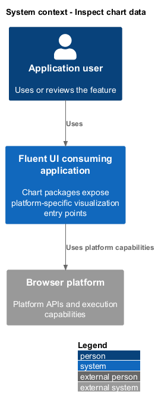
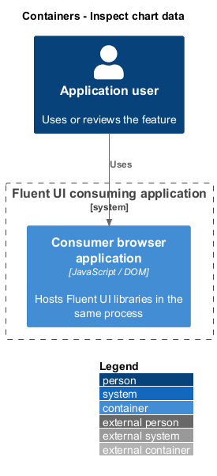
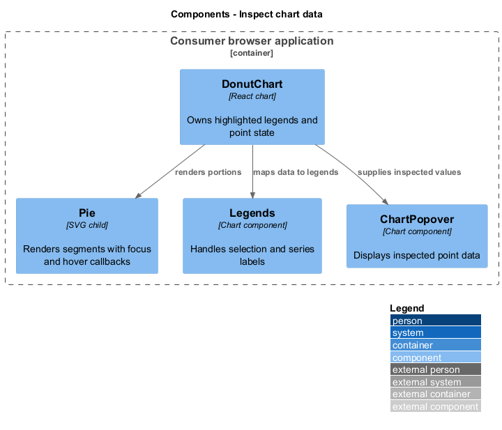
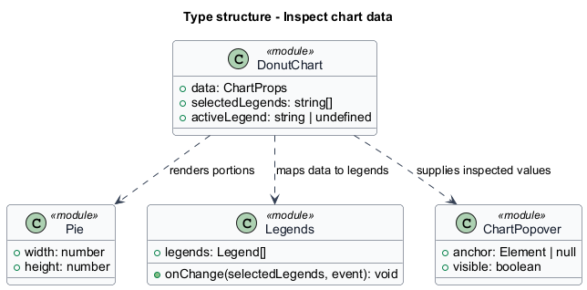
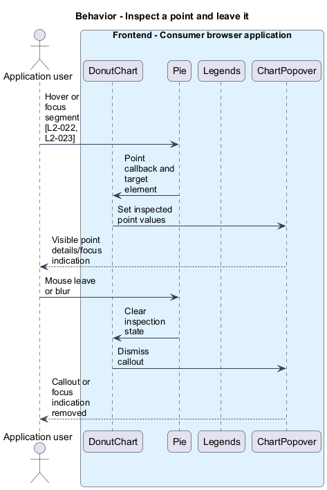
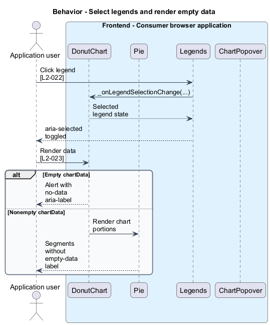

# Inspect chart data

## Overview

Chart packages expose platform-specific visualization entry points. `DonutChart` represents positive data portions as pie segments and connects those segments to legends and callouts. Legend — labelled series control associated with a data portion. A callout exposes the currently inspected point.

## Description

The slice belongs to the `charts` subsystem. It executes in the consumer browser; no Fluent UI application backend participates.

**Building blocks.** Names identify inspected implementations, platform types, or explicitly proposed acceptance artifacts.

- `DonutChart` — React chart that owns highlighted legends and point state.
- `Pie` — SVG child that renders segments with focus and hover callbacks.
- `Legends` — Chart component that handles selection and series labels.
- `ChartPopover` — Chart component that displays inspected point data.

**Current behavior.** React chart exports include `DonutChart`, HorizontalBarChart, LineChart, and `ResponsiveContainer` alongside additional families. The inspected Web Component chart entry exports HorizontalBarChart and `DonutChart` with definitions, templates, and styles. `DonutChart` combines `Pie`, `Legends`, and `ChartPopover`, tracks hover and selected legends, and exposes an alert element with the empty-data label.

**Conformance gaps and required changes.** The tests demonstrate legend selection, callout mouse-leave behavior, focus indicators, and the empty-data label. They are not a complete semantic specification of every chart. `DonutChart`'s `React.FunctionComponent` declaration also deviates from the prescribed `ForwardRefComponent` pattern; required remediation shall preserve its forwarded ref and public props.

**Validation scenarios.** Fixtures use chartPointsDC and emptyChartPoints from the test evidence. They cover legend toggling, hideLegend, segment hover/leave, focus/blur, and the empty label. Availability checks inspect actual exports per platform.

**Source evidence.** These links establish provenance, not executed acceptance results.

- [index.ts](../../../../packages/charts/react-charts/library/src/index.ts).
- [index.ts](../../../../packages/charts/chart-web-components/src/index.ts).
- [DonutChart.tsx](../../../../packages/charts/react-charts/library/src/components/DonutChart/DonutChart.tsx).
- [DonutChart.types.ts](../../../../packages/charts/react-charts/library/src/components/DonutChart/DonutChart.types.ts).
- [DonutChart.test.tsx](../../../../packages/charts/react-charts/library/src/components/DonutChart/DonutChart.test.tsx).

## Requirements

The table quotes exact L2 statements from the [detailed specification](../../../specs/L2.md). Original obligation wording is preserved in quotations.

| L2 ID | Refines (L1) | Requirement |
| --- | --- | --- |
| `L2-021` | `L1-008` | Chart availability must be based on each platform's public exports. |
| `L2-022` | `L1-008` | DonutChart must provide the observed point and legend interactions. |
| `L2-023` | `L1-008` | DonutChart must expose its empty state and preserve the observed focus behavior. |

## Diagrams

Function modules and TypeScript records appear as UML projections rather than invented runtime classes. Proposed acceptance artifacts remain identified as targets. Fields and signatures show the slice rather than every public property.

### System context

The context view places the feature in its consumer application or delivery workflow. The external platform supplies execution capabilities.

### Containers

The container view identifies execution processes and artifact storage. Library packages remain within the consuming process.

### Components

The component view identifies the feature's blocks. Labelled relationships show implementation dependencies or explicit review relationships.

### Type structure

The type view shows representative fields and callable signatures. Dependency and inheritance arrows identify distinct structural relationships.

### Behavior — Inspect a point and leave it

The sequence follows inspect a point and leave it. Requirement IDs mark enforcement or acceptance-review steps, and alternate branches expose significant state or failure paths.

### Behavior — Select legends and render empty data

The sequence follows select legends and render empty data. Requirement IDs mark enforcement or acceptance-review steps, and alternate branches expose significant state or failure paths.

