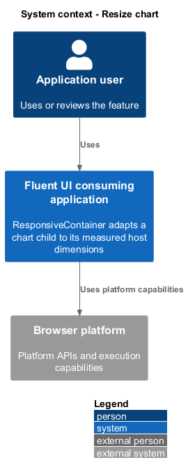
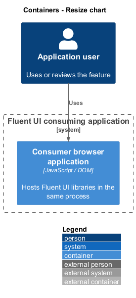
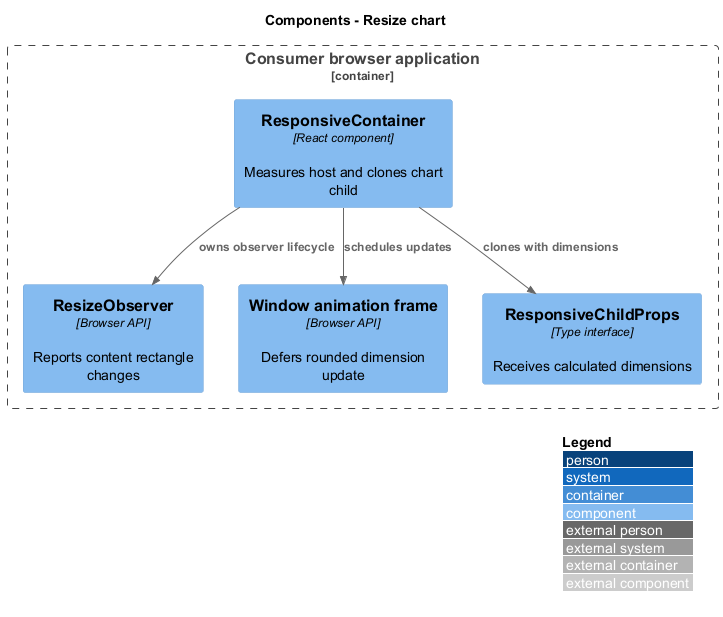
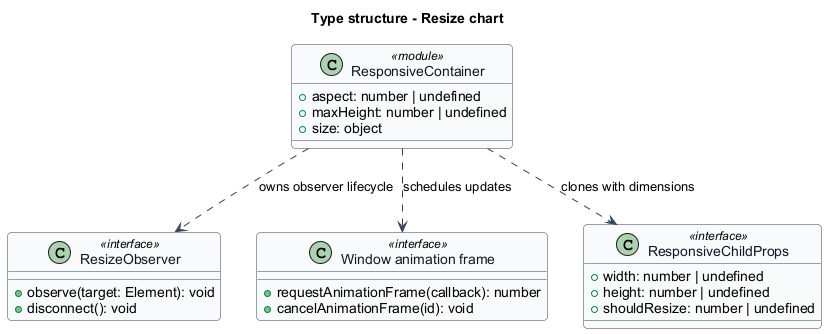
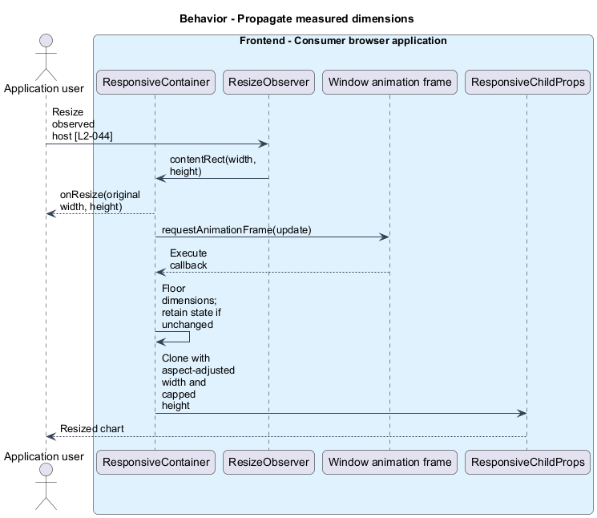
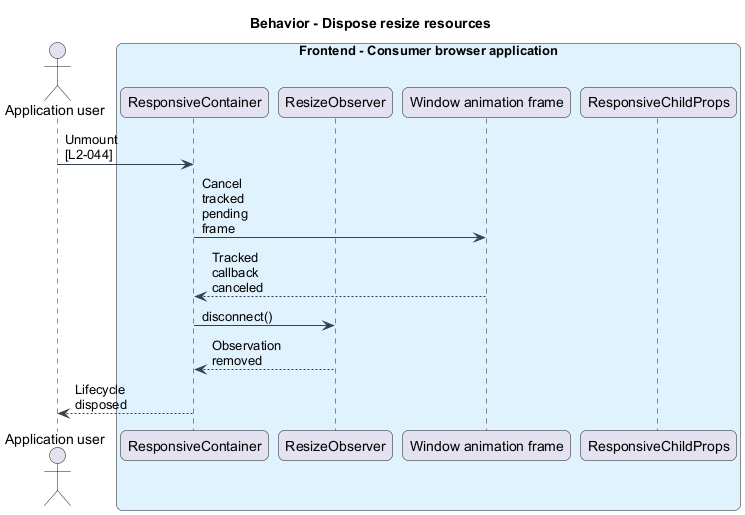

# Resize chart

## Overview

`ResponsiveContainer` adapts a chart child to its measured host dimensions. Aspect ratio — positive width-to-height ratio applied after measurement. The container coordinates browser resize notifications, React dimension state, and cleanup when the chart leaves the page.

## Description

The slice belongs to the `charts` subsystem. It executes in the consumer browser; no Fluent UI application backend participates.

**Building blocks.** Names identify inspected implementations, platform types, or explicitly proposed acceptance artifacts.

- `ResponsiveContainer` — React component that measures host and clones chart child.
- `ResizeObserver` — Browser API that reports content rectangle changes.
- `Window animation frame` — Browser API that defers rounded dimension update.
- `ResponsiveChildProps` — Type interface that receives calculated dimensions.

**Current behavior.** The resize callback sends unrounded values to `onResize`, schedules floored dimensions in `requestAnimationFrame`, and retains the existing size object when rounded values match. A positive aspect ratio recalculates height and applies `maxHeight`. The child receives calculated dimensions and a `shouldResize` sum. Cleanup disconnects the observer and cancels the tracked frame.

**Conformance gaps and required changes.** The component uses `React.FC`, obtains the window through a chart utility, and merges library classes after consumer classes. Required remediation shall follow AGENTS.md while preserving measured sizing. The code tracks the latest frame ID; cancellation of earlier concurrently queued frames is not an established guarantee. Missing `ResizeObserver` leaves dimensions unmeasured.

**Validation scenarios.** A child spy checks fractional rounding, original callback dimensions, positive aspect ratio, height capping, repeated dimensions, and cleanup. The viewport fixtures remain acceptance targets.

**Source evidence.** These links establish provenance, not executed acceptance results.

- [ResponsiveContainer.tsx](../../../../packages/charts/react-charts/library/src/components/ResponsiveContainer/ResponsiveContainer.tsx).
- [ResponsiveContainer.types.ts](../../../../packages/charts/react-charts/library/src/components/ResponsiveContainer/ResponsiveContainer.types.ts).
- [getWindow.ts](../../../../packages/charts/react-charts/library/src/utilities/getWindow.ts).
- [AGENTS.md](../../../../AGENTS.md).

## Requirements

The table quotes exact L2 statements from the [detailed specification](../../../specs/L2.md). Original obligation wording is preserved in quotations.

| L2 ID | Refines (L1) | Requirement |
| --- | --- | --- |
| `L2-044` | `L1-016` | ResponsiveContainer must propagate measured dimensions, apply its documented positive aspect ratio and height cap, and clean up its observer on unmount. |
| `L2-006` | `L1-002` | React v9 style hooks must retain consumer class names and place them last in each slot's mergeClasses call. |
| `L2-032` | `L1-012` | New v9 components must separate state, styles, render, types, and the forward-ref entry component. |

## Diagrams

Function modules and TypeScript records appear as UML projections rather than invented runtime classes. Proposed acceptance artifacts remain identified as targets. Fields and signatures show the slice rather than every public property.

### System context

The context view places the feature in its consumer application or delivery workflow. The external platform supplies execution capabilities.

### Containers

The container view identifies execution processes and artifact storage. Library packages remain within the consuming process.

### Components

The component view identifies the feature's blocks. Labelled relationships show implementation dependencies or explicit review relationships.

### Type structure

The type view shows representative fields and callable signatures. Dependency and inheritance arrows identify distinct structural relationships.

### Behavior — Propagate measured dimensions

The sequence follows propagate measured dimensions. Requirement IDs mark enforcement or acceptance-review steps, and alternate branches expose significant state or failure paths.

### Behavior — Dispose resize resources

The sequence follows dispose resize resources. Requirement IDs mark enforcement or acceptance-review steps, and alternate branches expose significant state or failure paths.

