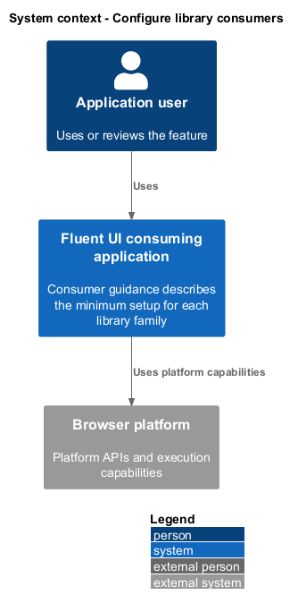
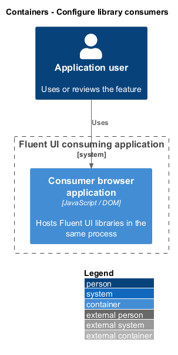
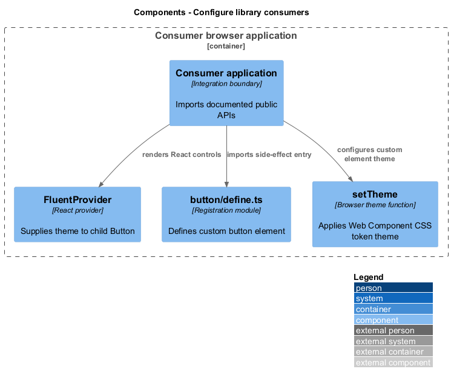
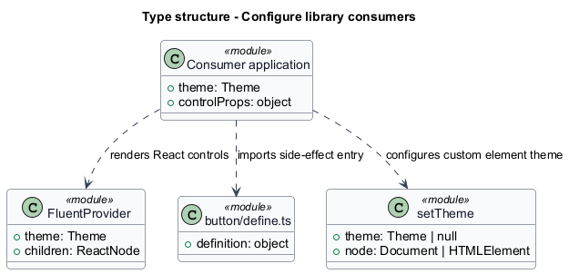
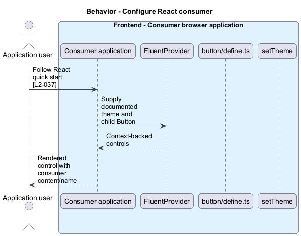
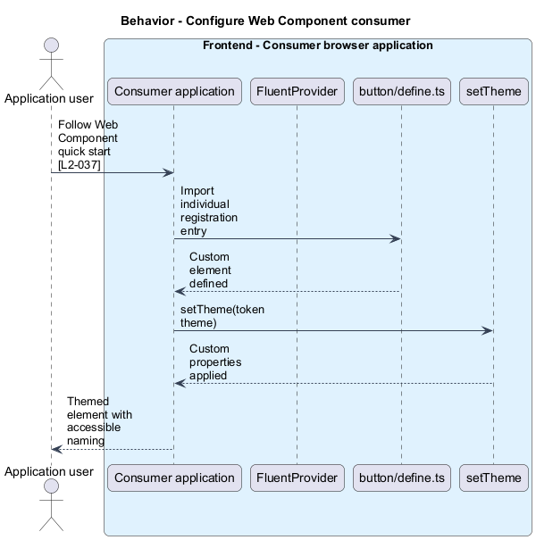

# Configure library consumers

## Overview

Consumer guidance describes the minimum setup for each library family. React controls obtain shared theme context from `FluentProvider`. Web Components register custom elements and apply token themes through `setTheme`. Customization documentation retains accessible-name and semantic responsibilities with the host.

## Description

The slice belongs to the `consumer-guidance` subsystem. It executes in the consumer browser; no Fluent UI application backend participates.

**Building blocks.** Names identify inspected implementations, platform types, or explicitly proposed acceptance artifacts.

- `Consumer application` — Integration boundary that imports documented public APIs.
- `FluentProvider` — React provider that supplies theme to child `Button`.
- `button/define.ts` — Registration module that defines custom button element.
- `setTheme` — Browser theme function that applies Web Component CSS token theme.

**Current behavior.** The React quick start imports `FluentProvider`, a theme, and `Button` from the suite, then places the control under the themed provider. Web Component guidance imports registration entry points and calls `setTheme` with a theme from the token package. The conventions document accessibility guidance and component-specific specifications.

**Conformance gaps and required changes.** An icon-only or customized control shall preserve a consumer-supplied accessible name and supported semantics. Coverage of guidance for every component family remains unverified. The quick starts are integration examples rather than application authorization or persistence contracts.

**Validation scenarios.** Documentation checks inspect public imports, provider setup, registration setup, token source, and accessible-name responsibilities. Examples shall not infer setup from legacy initialization patterns.

**Source evidence.** These links establish provenance, not executed acceptance results.

- [README.md](../../../../packages/react-components/react-components/README.md).
- [README.md](../../../../packages/web-components/README.md).
- [component-patterns.md](../../../../docs/architecture/component-patterns.md).
- [Button.types.ts](../../../../packages/react-components/react-button/library/src/components/Button/Button.types.ts).

## Requirements

The table quotes exact L2 statements from the [detailed specification](../../../specs/L2.md). Original obligation wording is preserved in quotations.

| L2 ID | Refines (L1) | Requirement |
| --- | --- | --- |
| `L2-037` | `L1-014` | Consumer documentation must show required setup and explain accessibility responsibilities when customizing controls. |

## Diagrams

Function modules and TypeScript records appear as UML projections rather than invented runtime classes. Proposed acceptance artifacts remain identified as targets. Fields and signatures show the slice rather than every public property.

### System context

The context view places the feature in its consumer application or delivery workflow. The external platform supplies execution capabilities.

### Containers

The container view identifies execution processes and artifact storage. Library packages remain within the consuming process.

### Components

The component view identifies the feature's blocks. Labelled relationships show implementation dependencies or explicit review relationships.

### Type structure

The type view shows representative fields and callable signatures. Dependency and inheritance arrows identify distinct structural relationships.

### Behavior — Configure React consumer

The sequence follows configure React consumer. Requirement IDs mark enforcement or acceptance-review steps, and alternate branches expose significant state or failure paths.

### Behavior — Configure Web Component consumer

The sequence follows configure Web Component consumer. Requirement IDs mark enforcement or acceptance-review steps, and alternate branches expose significant state or failure paths.

