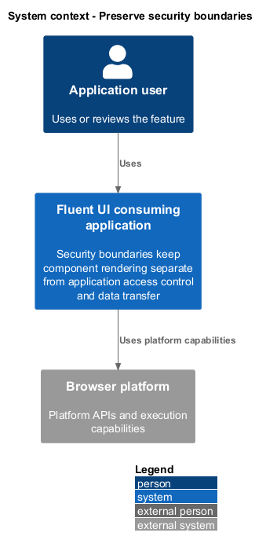
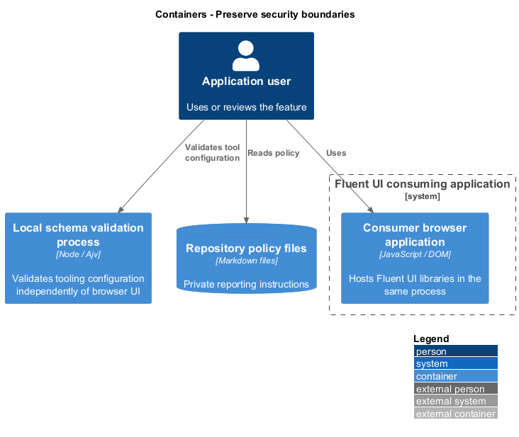
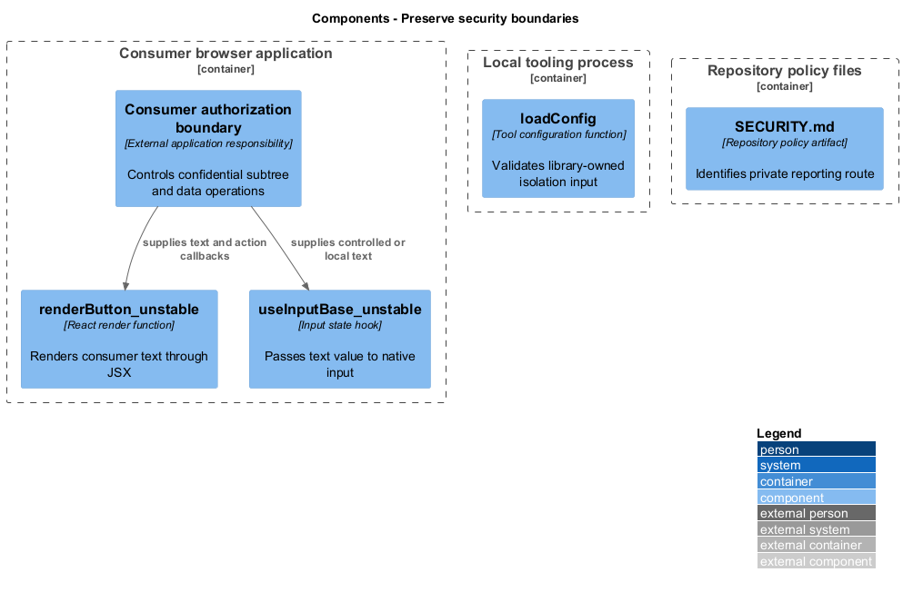
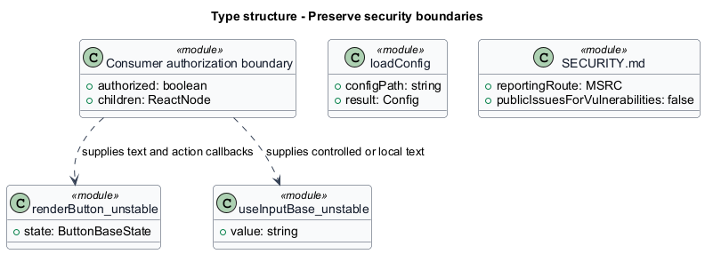
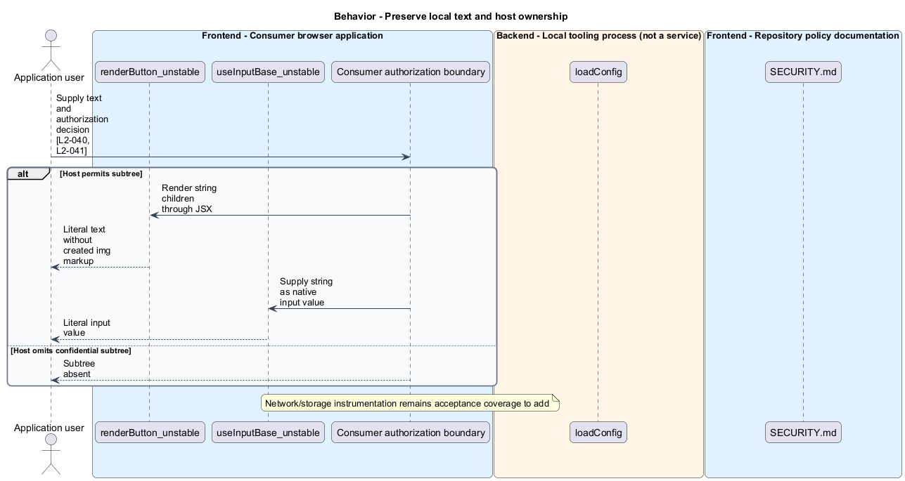
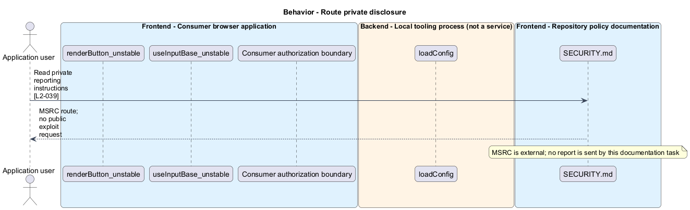
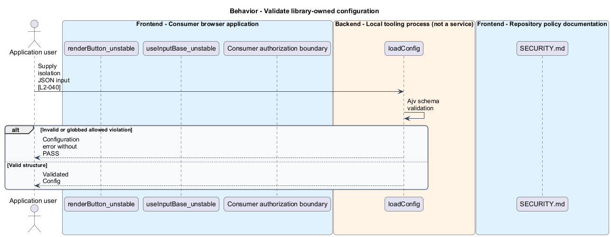

# Preserve security boundaries

## Overview

Security boundaries keep component rendering separate from application access control and data transfer. Text boundary — default rendering path that preserves a supplied string as text rather than executable markup. The private disclosure policy directs vulnerability reports to MSRC.

## Description

The slice belongs to the `consumer-guidance` subsystem. It spans browser text rendering, independent local schema validation, and repository policy. No Fluent UI authentication backend is introduced.

**Building blocks.** Names identify inspected implementations, platform types, or explicitly proposed acceptance artifacts.

- `renderButton_unstable` — React render function that renders consumer text through JSX.
- `useInputBase_unstable` — `Input` state hook that passes text value to native input.
- `loadConfig` — Tool configuration function that validates library-owned isolation input.
- `Consumer authorization boundary` — External application responsibility that controls confidential subtree and data operations.
- `SECURITY.md` — Repository policy artifact that identifies private reporting route.

**Current behavior.** Default `Button` JSX renders string children through React. `Input` places its string value on a native input. The isolation loader validates configuration with Ajv, and the Web Component theme function sanitizes its own token boundary. SECURITY.md directs private reports to MSRC and rejects public vulnerability disclosure through GitHub issues.

**Conformance gaps and required changes.** Instrumented proof of no unsolicited network/storage activity is a target, not an established universal guarantee. Consumer callbacks, links, resources, and forms retain explicit host behavior. Disabled state shall not be described as authorization. Neither default JSX nor token sanitization establishes a universal HTML or URL sanitizer.

**Validation scenarios.** Fixtures render the literal attack-like text from L2-040 without HTML overrides, reject invalid isolation allowances, omit unauthorized host subtrees, and instrument local control activity. Private-report guidance is inspected separately.

**Source evidence.** These links establish provenance, not executed acceptance results.

- [SECURITY.md](../../../../SECURITY.md).
- [renderButton.tsx](../../../../packages/react-components/react-button/library/src/components/Button/renderButton.tsx).
- [useInput.ts](../../../../packages/react-components/react-input/library/src/components/Input/useInput.ts).
- [config.ts](../../../../tools/verify-bundle-isolation/src/config.ts).
- [schema.json](../../../../tools/verify-bundle-isolation/schema.json).
- [set-theme.ts](../../../../packages/web-components/src/theme/set-theme.ts).
- [L2.md](../../../../docs/specs/L2.md).

## Requirements

The table quotes exact L2 statements from the [detailed specification](../../../specs/L2.md). Original obligation wording is preserved in quotations.

| L2 ID | Refines (L1) | Requirement |
| --- | --- | --- |
| `L2-039` | `L1-015` | Security guidance must direct vulnerability reports to Microsoft's private security-reporting route. |
| `L2-040` | `L1-015` | Text-bearing controls must preserve literal text at their default text boundary, and bundle isolation must validate its structured configuration before reporting success. |
| `L2-041` | `L1-015` | Default local control interactions must leave persistence, transmission, and access control to the host. Explicit navigation, resource, and form APIs retain their documented browser behavior. |

## Diagrams

Function modules and TypeScript records appear as UML projections rather than invented runtime classes. Proposed acceptance artifacts remain identified as targets. Fields and signatures show the slice rather than every public property.

### System context

The context view places the feature in its consumer application or delivery workflow. The external platform supplies execution capabilities.

### Containers

The container view identifies execution processes and artifact storage. Library packages remain within the consuming process.

### Components

The component view identifies the feature's blocks. Labelled relationships show implementation dependencies or explicit review relationships.

### Type structure

The type view shows representative fields and callable signatures. Dependency and inheritance arrows identify distinct structural relationships.

### Behavior — Preserve local text and host ownership

The sequence follows preserve local text and host ownership. Requirement IDs mark enforcement or acceptance-review steps, and alternate branches expose significant state or failure paths.

### Behavior — Route private disclosure

The sequence follows route private disclosure. Requirement IDs mark enforcement or acceptance-review steps, and alternate branches expose significant state or failure paths.

### Behavior — Validate library-owned configuration

The sequence follows validate library-owned configuration. Requirement IDs mark enforcement or acceptance-review steps, and alternate branches expose significant state or failure paths.

