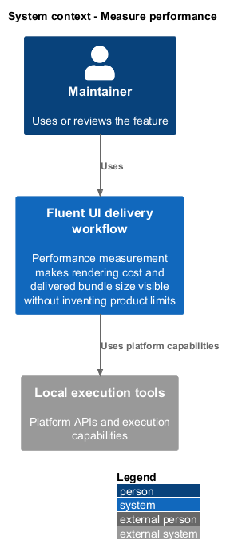
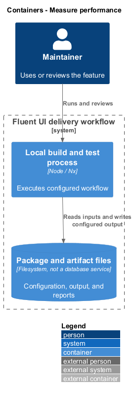
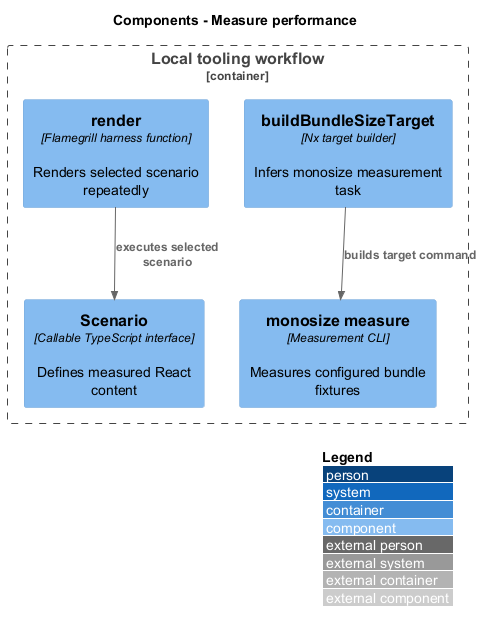
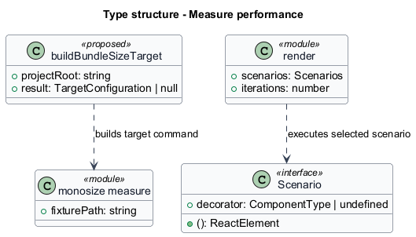
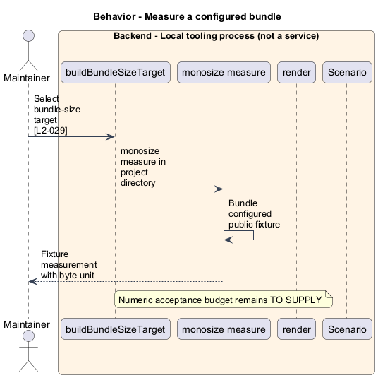
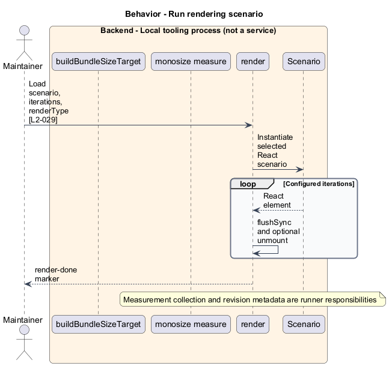

# Measure performance

## Overview

Performance measurement makes rendering cost and delivered bundle size visible without inventing product limits. `Scenario` — exported React function rendered by the performance harness. Bundle fixture — entry point used by monosize to measure delivered code.

## Description

The slice belongs to the `delivery-tooling` subsystem. It executes as local tooling or CI work. The backend tier denotes a tool process rather than an application service.

**Building blocks.** Names identify inspected implementations, platform types, or explicitly proposed acceptance artifacts.

- `buildBundleSizeTarget` — Nx target builder that infers monosize measurement task.
- `monosize measure` — Measurement CLI that measures configured bundle fixtures.
- `render` — Flamegrill harness function that renders selected scenario repeatedly.
- `Scenario` — Callable TypeScript interface that defines measured React content.

**Current behavior.** The workspace plugin infers bundle-size when bundle-size fixtures or a monosize configuration exists. It executes monosize measure in the project directory. The React performance harness selects a scenario and iteration count from query parameters, renders with `React DOM`, and adds a render-done marker. The configured test-perf target depends on the bundle target.

**Conformance gaps and required changes.** Measurement report provenance across revisions is a detailed target that still requires validation against actual runner output. Numeric runtime, memory, throughput, and bundle budgets remain `<TO SUPPLY>`. Historical sample counts do not establish thresholds. No performance pass claim follows from a measurement alone.

**Validation scenarios.** Run configured Nx measurement targets and inspect scenario identifiers, units, revisions, and results. Reports without configured thresholds shall remain measurement-only.

**Source evidence.** These links establish provenance, not executed acceptance results.

- [workspace-plugin.ts](../../../../tools/workspace-plugin/src/plugins/workspace-plugin.ts).
- [project.json](../../../../apps/perf-test-react-components/project.json).
- [renderer.tsx](../../../../scripts/perf-test-flamegrill/src/renderer.tsx).
- [types.ts](../../../../scripts/perf-test-flamegrill/src/types.ts).
- [bundle-size.yml](../../../../.github/workflows/bundle-size.yml).

## Requirements

The table quotes exact L2 statements from the [detailed specification](../../../specs/L2.md). Original obligation wording is preserved in quotations.

| L2 ID | Refines (L1) | Requirement |
| --- | --- | --- |
| `L2-029` | `L1-011` | Configured performance and bundle scenarios must produce measurements attributable to a scenario and revision. Pass/fail thresholds must be explicit rather than inferred from historical examples. |

## Diagrams

Function modules and TypeScript records appear as UML projections rather than invented runtime classes. Proposed acceptance artifacts remain identified as targets. Fields and signatures show the slice rather than every public property.

### System context

The context view places the feature in its consumer application or delivery workflow. The external platform supplies execution capabilities.

### Containers

The container view identifies execution processes and artifact storage. Library packages remain within the consuming process.

### Components

The component view identifies the feature's blocks. Labelled relationships show implementation dependencies or explicit review relationships.

### Type structure

The type view shows representative fields and callable signatures. Dependency and inheritance arrows identify distinct structural relationships.

### Behavior — Measure a configured bundle

The sequence follows measure a configured bundle. Requirement IDs mark enforcement or acceptance-review steps, and alternate branches expose significant state or failure paths.

### Behavior — Run rendering scenario

The sequence follows run rendering scenario. Requirement IDs mark enforcement or acceptance-review steps, and alternate branches expose significant state or failure paths.

