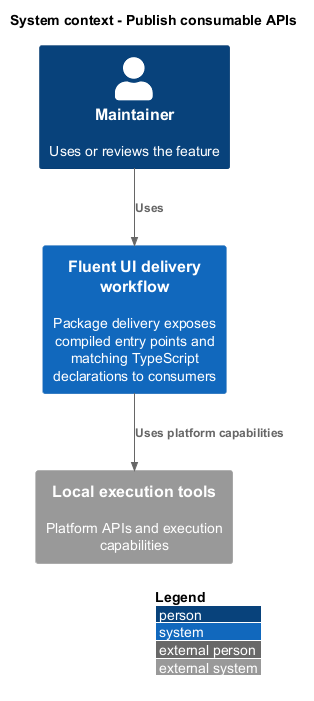
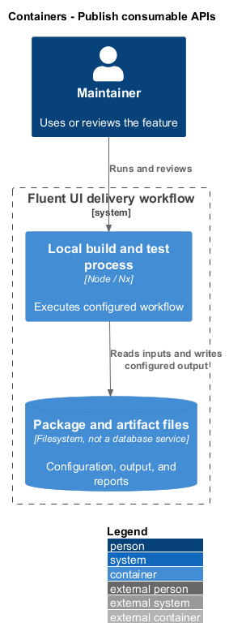
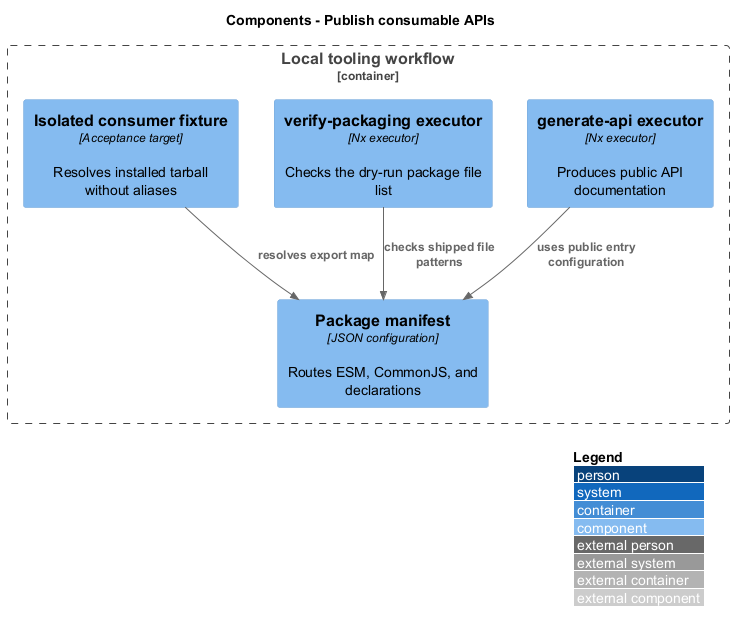
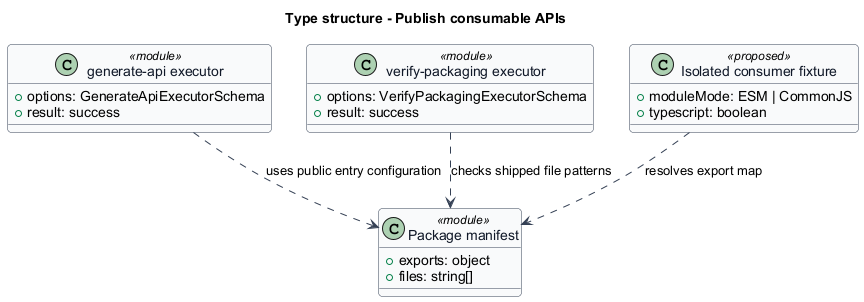
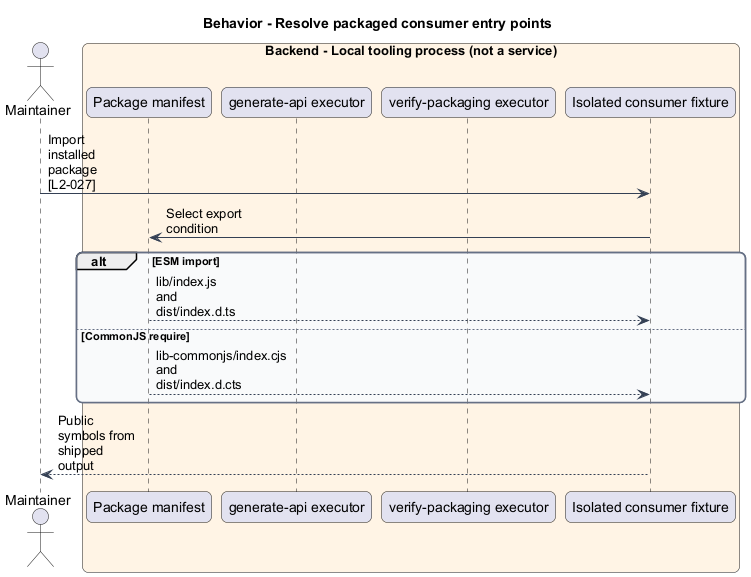
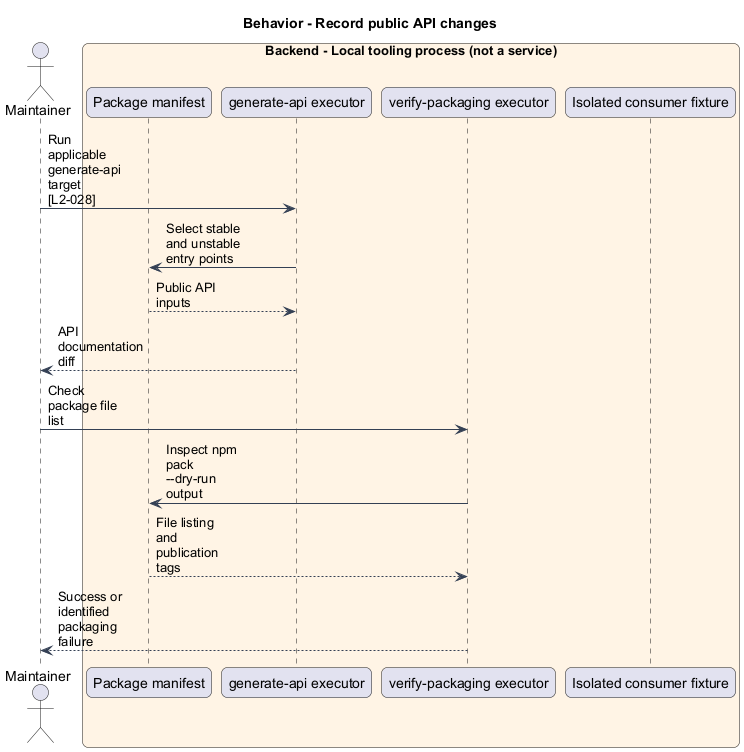

# Publish consumable APIs

## Overview

Package delivery exposes compiled entry points and matching TypeScript declarations to consumers. Export map — manifest routing from public import paths to shipped files. Stable and unstable entry points distinguish supported API surfaces without requiring consumers to resolve repository sources.

## Description

The slice belongs to the `delivery-tooling` subsystem. It executes as local tooling or CI work. The backend tier denotes a tool process rather than an application service.

**Building blocks.** Names identify inspected implementations, platform types, or explicitly proposed acceptance artifacts.

- `Package manifest` — JSON configuration that routes ESM, CommonJS, and declarations.
- `generate-api executor` — Nx executor that produces public API documentation.
- `verify-packaging executor` — Nx executor that checks the dry-run package file list.
- `Isolated consumer fixture` — Acceptance target that resolves installed tarball without aliases.

**Current behavior.** The React suite export map sends ESM imports to lib/index.js and CommonJS requires to lib-commonjs/index.cjs. Each branch has its own declaration extension. The unstable subpath has separate entry points and declarations. Build assets provide unstable templates; the repository plugin infers API generation and applicable packaging checks.

**Conformance gaps and required changes.** L2-027's isolated installed-tarball fixture is a target, not proof that the existing verification executor implements every listed case. Required validation shall resolve shipped output without source aliases. Exact compatibility approval for a removed API follows the contribution workflow.

**Validation scenarios.** Check ESM, CommonJS, TypeScript, unstable versus stable exports, and Web Component assets in packaged output. Public API generation shall expose added exports and identify removals.

**Source evidence.** These links establish provenance, not executed acceptance results.

- [package.json](../../../../packages/react-components/react-components/package.json).
- [project.json](../../../../packages/react-components/react-components/project.json).
- [index.ts](../../../../packages/react-components/react-components/src/unstable/index.ts).
- [executor.ts](../../../../tools/workspace-plugin/src/executors/generate-api/executor.ts).
- [executor.ts](../../../../tools/workspace-plugin/src/executors/verify-packaging/executor.ts).
- [package.json](../../../../packages/web-components/package.json).

## Requirements

The table quotes exact L2 statements from the [detailed specification](../../../specs/L2.md). Original obligation wording is preserved in quotations.

| L2 ID | Refines (L1) | Requirement |
| --- | --- | --- |
| `L2-027` | `L1-010` | Shipped packages must resolve public code and declaration entry points from packaged output. |
| `L2-028` | `L1-010` | Public API changes must update the repository's generated API documentation and respect public-versus-unstable entry points. |

## Diagrams

Function modules and TypeScript records appear as UML projections rather than invented runtime classes. Proposed acceptance artifacts remain identified as targets. Fields and signatures show the slice rather than every public property.

### System context

The context view places the feature in its consumer application or delivery workflow. The external platform supplies execution capabilities.

### Containers

The container view identifies execution processes and artifact storage. Library packages remain within the consuming process.

### Components

The component view identifies the feature's blocks. Labelled relationships show implementation dependencies or explicit review relationships.

### Type structure

The type view shows representative fields and callable signatures. Dependency and inheritance arrows identify distinct structural relationships.

### Behavior — Resolve packaged consumer entry points

The sequence follows resolve packaged consumer entry points. Requirement IDs mark enforcement or acceptance-review steps, and alternate branches expose significant state or failure paths.

### Behavior — Record public API changes

The sequence follows record public API changes. Requirement IDs mark enforcement or acceptance-review steps, and alternate branches expose significant state or failure paths.

