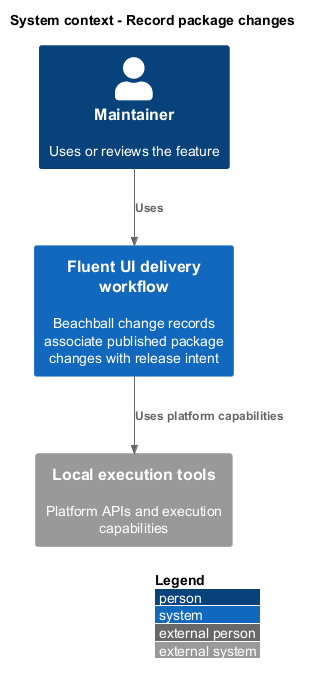
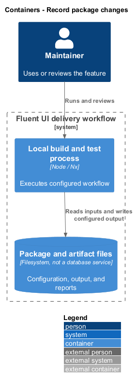
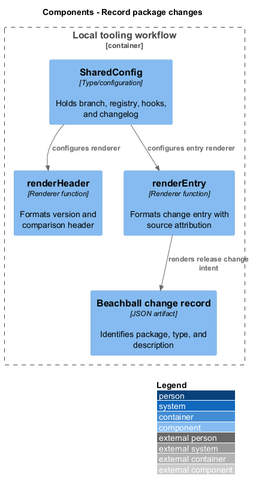
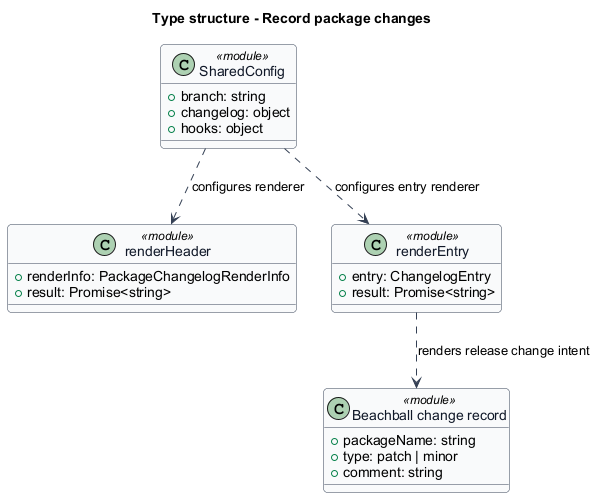
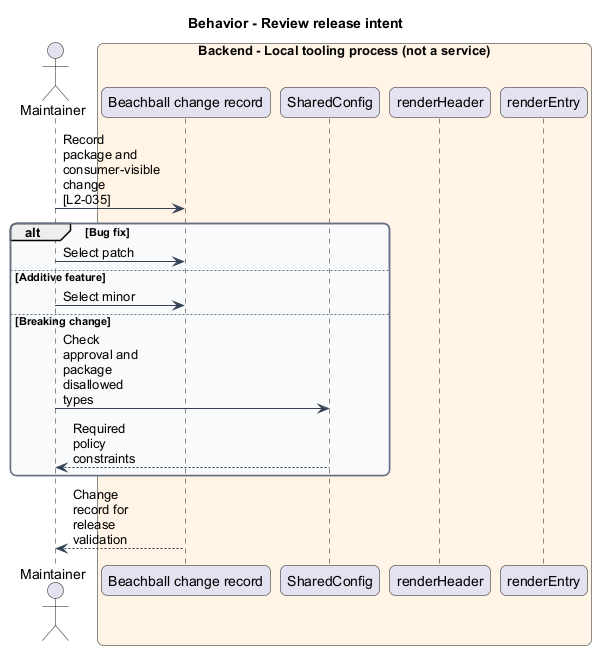
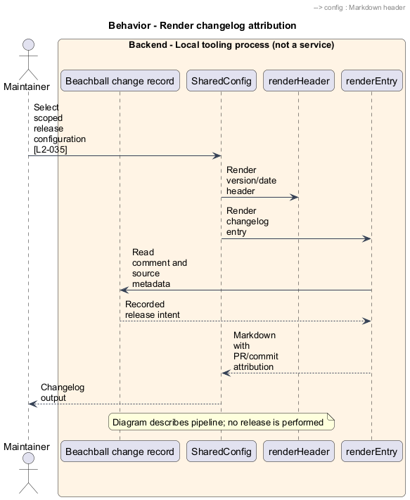

# Record package changes

## Overview

Beachball change records associate published package changes with release intent. Change type — patch for fixes or minor for additive capabilities under the repository workflow. Release configuration supplies scoped package groups and custom changelog rendering.

## Description

The slice belongs to the `delivery-tooling` subsystem. It executes as local tooling or CI work. The backend tier denotes a tool process rather than an application service.

**Building blocks.** Names identify inspected implementations, platform types, or explicitly proposed acceptance artifacts.

- `Beachball change record` — JSON artifact that identifies package, type, and description.
- `SharedConfig` — Type/configuration that holds branch, registry, hooks, and changelog.
- `renderHeader` — Renderer function that formats version and comparison header.
- `renderEntry` — Renderer function that formats change entry with source attribution.

**Current behavior.** Contribution guidance requires a change file for published package modifications. The root package exposes change and check:change scripts. Shared release configuration sets the release branch and changelog renderers. `renderHeader` includes version and comparison references; `renderEntry` includes the change comment and PR or commit attribution.

**Conformance gaps and required changes.** The major approval rule does not override a package's explicit disallowedChangeTypes configuration. The inspected suite disallows major. A future approved breaking change still requires compatible release configuration. This documentation-only change does not alter a published package.

**Validation scenarios.** Review package name, patch/minor type, and consumer-visible description against the diff. Published-change checks retain missing records as failures. No publish or release pipeline is executed by this design work.

**Source evidence.** These links establish provenance, not executed acceptance results.

- [contributing.md](../../../../docs/workflows/contributing.md).
- [shared.config.ts](../../../../scripts/beachball/src/shared.config.ts).
- [customRenderers.ts](../../../../scripts/beachball/src/customRenderers.ts).
- [package.json](../../../../packages/react-components/react-components/package.json).
- [package.json](../../../../package.json).
- [check-packages.yml](../../../../.github/workflows/check-packages.yml).

## Requirements

The table quotes exact L2 statements from the [detailed specification](../../../specs/L2.md). Original obligation wording is preserved in quotations.

| L2 ID | Refines (L1) | Requirement |
| --- | --- | --- |
| `L2-035` | `L1-013` | Changes to published packages must include the required release change files. |

## Diagrams

Function modules and TypeScript records appear as UML projections rather than invented runtime classes. Proposed acceptance artifacts remain identified as targets. Fields and signatures show the slice rather than every public property.

### System context

The context view places the feature in its consumer application or delivery workflow. The external platform supplies execution capabilities.

### Containers

The container view identifies execution processes and artifact storage. Library packages remain within the consuming process.

### Components

The component view identifies the feature's blocks. Labelled relationships show implementation dependencies or explicit review relationships.

### Type structure

The type view shows representative fields and callable signatures. Dependency and inheritance arrows identify distinct structural relationships.

### Behavior — Review release intent

The sequence follows review release intent. Requirement IDs mark enforcement or acceptance-review steps, and alternate branches expose significant state or failure paths.

### Behavior — Render changelog attribution

The sequence follows render changelog attribution. Requirement IDs mark enforcement or acceptance-review steps, and alternate branches expose significant state or failure paths.

