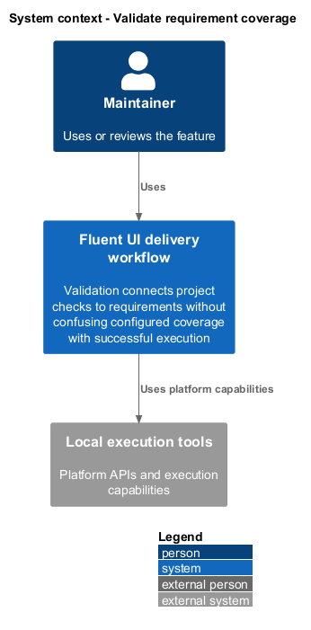
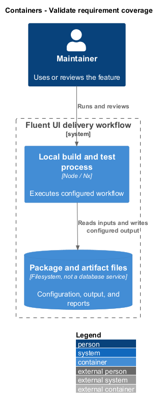
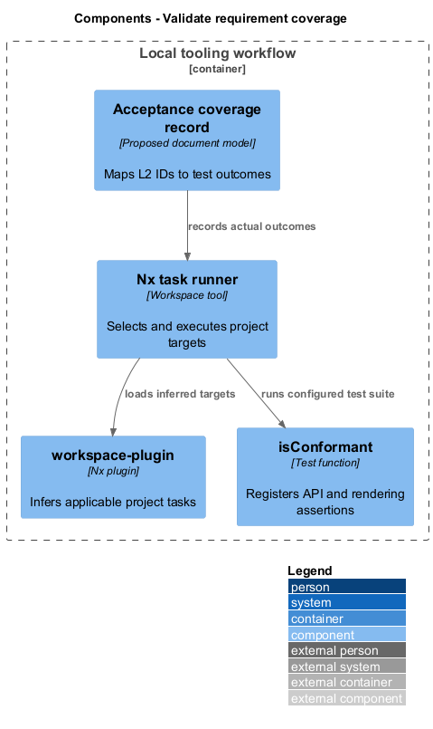
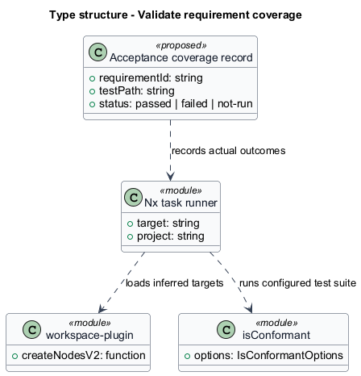
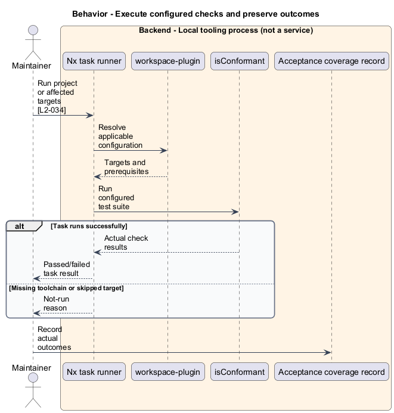
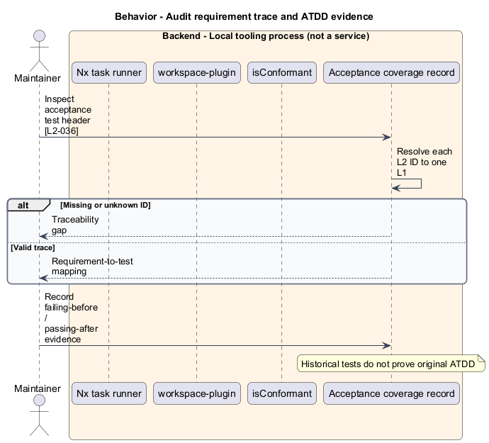

# Validate requirement coverage

## Overview

Validation connects project checks to requirements without confusing configured coverage with successful execution. Acceptance trace — test-file comment identifying the L2 requirements enforced by the file. Nx coordinates project tasks; a separate coverage record captures execution outcomes and unmet requirements.

## Description

The slice belongs to the `delivery-tooling` subsystem. It executes as local tooling or CI work. The backend tier denotes a tool process rather than an application service.

**Building blocks.** Names identify inspected implementations, platform types, or explicitly proposed acceptance artifacts.

- `Nx task runner` — Workspace tool that selects and executes project targets.
- `workspace-plugin` — Nx plugin that infers applicable project tasks.
- `isConformant` — Test function that registers API and rendering assertions.
- `Acceptance coverage record` — Proposed document model that maps L2 IDs to test outcomes.

**Current behavior.** The workspace defines cached project targets and dependency prerequisites. The plugin infers additional targets from project files and tags. `isConformant` registers component API assertions alongside unit tests. The inspected PR workflow runs affected build, test, lint, type, SSR, integration, packaging, and isolation tasks.

**Conformance gaps and required changes.** The acceptance coverage record is a proposed documentation artifact, not an implemented service. Existing tests generally lack the new L2 header convention. Future acceptance tests shall include the trace header, and reporting shall preserve failed and not-run outcomes. The document task runner does not certify application validation.

**Validation scenarios.** Check every acceptance header against existing L2 IDs. Record target command, result, and reason for not-run checks. Future implementation evidence pairs a pre-change failing acceptance test with its post-change pass.

**Source evidence.** These links establish provenance, not executed acceptance results.

- [nx.json](../../../../nx.json).
- [workspace-plugin.ts](../../../../tools/workspace-plugin/src/plugins/workspace-plugin.ts).
- [isConformant.ts](../../../../packages/react-conformance/src/isConformant.ts).
- [types.ts](../../../../packages/react-conformance/src/types.ts).
- [testing.md](../../../../docs/workflows/testing.md).
- [pr.yml](../../../../.github/workflows/pr.yml).
- [L2.md](../../../../docs/specs/L2.md).

## Requirements

The table quotes exact L2 statements from the [detailed specification](../../../specs/L2.md). Original obligation wording is preserved in quotations.

| L2 ID | Refines (L1) | Requirement |
| --- | --- | --- |
| `L2-034` | `L1-013` | Project tasks must run through Nx and validation summaries must retain their actual outcome. |
| `L2-036` | `L1-013` | New acceptance tests must identify their L2 requirements, and new implementations must follow the requirements-first acceptance workflow. |

## Diagrams

Function modules and TypeScript records appear as UML projections rather than invented runtime classes. Proposed acceptance artifacts remain identified as targets. Fields and signatures show the slice rather than every public property.

### System context

The context view places the feature in its consumer application or delivery workflow. The external platform supplies execution capabilities.

### Containers

The container view identifies execution processes and artifact storage. Library packages remain within the consuming process.

### Components

The component view identifies the feature's blocks. Labelled relationships show implementation dependencies or explicit review relationships.

### Type structure

The type view shows representative fields and callable signatures. Dependency and inheritance arrows identify distinct structural relationships.

### Behavior — Execute configured checks and preserve outcomes

The sequence follows execute configured checks and preserve outcomes. Requirement IDs mark enforcement or acceptance-review steps, and alternate branches expose significant state or failure paths.

### Behavior — Audit requirement trace and ATDD evidence

The sequence follows audit requirement trace and ATDD evidence. Requirement IDs mark enforcement or acceptance-review steps, and alternate branches expose significant state or failure paths.

