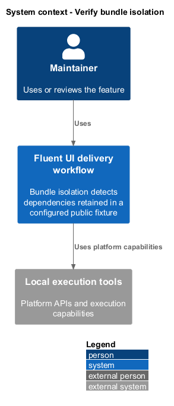
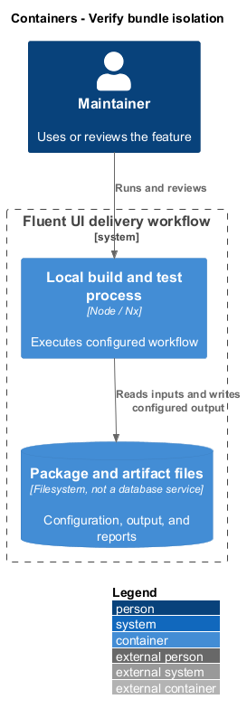
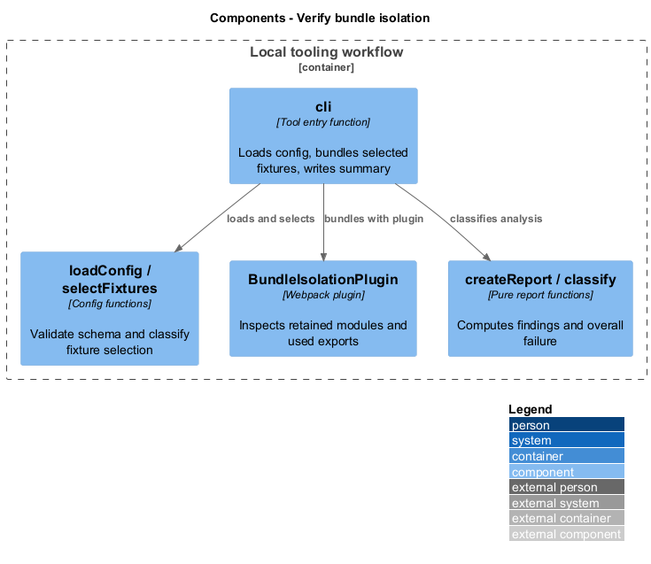
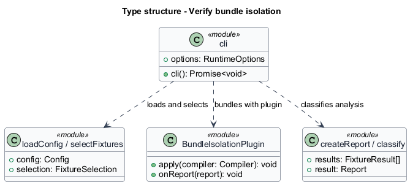
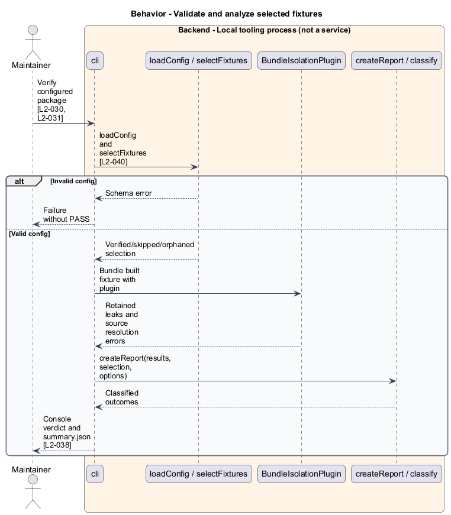
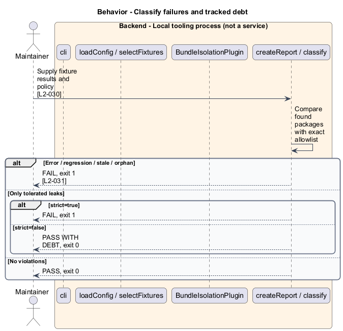

# Verify bundle isolation

## Overview

Bundle isolation detects dependencies retained in a configured public fixture. Forbidden package — dependency excluded by the package's policy. Allowed violation — exact retained package recorded as tracked debt. The checker inspects built output and distinguishes debt, regressions, stale entries, and uncovered fixtures.

## Description

The slice belongs to the `delivery-tooling` subsystem. It executes as local tooling or CI work. The backend tier denotes a tool process rather than an application service.

**Building blocks.** Names identify inspected implementations, platform types, or explicitly proposed acceptance artifacts.

- `cli` — Tool entry function that loads config, bundles selected fixtures, writes summary.
- `loadConfig / selectFixtures` — Config functions that validate schema and `classify` fixture selection.
- `BundleIsolationPlugin` — Webpack plugin that inspects retained modules and used exports.
- `createReport / classify` — Pure report functions that computes findings and overall failure.

**Current behavior.** `loadConfig` validates JSON with Ajv. `selectFixtures` separates opted-in, skipped, and orphaned entries. Webpack bundles built output with module concatenation disabled so package ownership stays visible. `collectLeaks` intersects retained chunks, used exports, and surviving importers. `createReport` fails on errors, regressions, stale debt, orphans, and tolerated leaks in strict mode.

**Conformance gaps and required changes.** The tool reports PASS WITH DEBT distinctly from PASS. Source resolution is an error, and skipped fixtures remain uncovered. Configuration acceptance rejects globbed allowed violations. Full runtime verdict coverage is not claimed from this source inspection.

**Validation scenarios.** Fixtures inject a clean bundle, new leak, exact allowed leak, stale allowance, orphan entry, source-resolution error, strict-mode allowed leak, and an unlisted discovered fixture.

**Source evidence.** These links establish provenance, not executed acceptance results.

- [cli.ts](../../../../tools/verify-bundle-isolation/src/cli.ts).
- [config.ts](../../../../tools/verify-bundle-isolation/src/config.ts).
- [bundle-isolation-plugin.ts](../../../../tools/verify-bundle-isolation/src/bundle-isolation-plugin.ts).
- [report.ts](../../../../tools/verify-bundle-isolation/src/report.ts).
- [schema.json](../../../../tools/verify-bundle-isolation/schema.json).
- [README.md](../../../../tools/verify-bundle-isolation/README.md).

## Requirements

The table quotes exact L2 statements from the [detailed specification](../../../specs/L2.md). Original obligation wording is preserved in quotations.

| L2 ID | Refines (L1) | Requirement |
| --- | --- | --- |
| `L2-030` | `L1-011` | Bundle isolation must classify clean output, explicitly tracked leaks, and regressions separately. |
| `L2-031` | `L1-011` | Isolation verification must reject invalid evidence and expose coverage omissions. |
| `L2-038` | `L1-014` | Development warnings and isolation reports must identify the problem and the affected context. |
| `L2-040` | `L1-015` | Text-bearing controls must preserve literal text at their default text boundary, and bundle isolation must validate its structured configuration before reporting success. |

## Diagrams

Function modules and TypeScript records appear as UML projections rather than invented runtime classes. Proposed acceptance artifacts remain identified as targets. Fields and signatures show the slice rather than every public property.

### System context

The context view places the feature in its consumer application or delivery workflow. The external platform supplies execution capabilities.

### Containers

The container view identifies execution processes and artifact storage. Library packages remain within the consuming process.

### Components

The component view identifies the feature's blocks. Labelled relationships show implementation dependencies or explicit review relationships.

### Type structure

The type view shows representative fields and callable signatures. Dependency and inheritance arrows identify distinct structural relationships.

### Behavior — Validate and analyze selected fixtures

The sequence follows validate and analyze selected fixtures. Requirement IDs mark enforcement or acceptance-review steps, and alternate branches expose significant state or failure paths.

### Behavior — Classify failures and tracked debt

The sequence follows `classify` failures and tracked debt. Requirement IDs mark enforcement or acceptance-review steps, and alternate branches expose significant state or failure paths.

