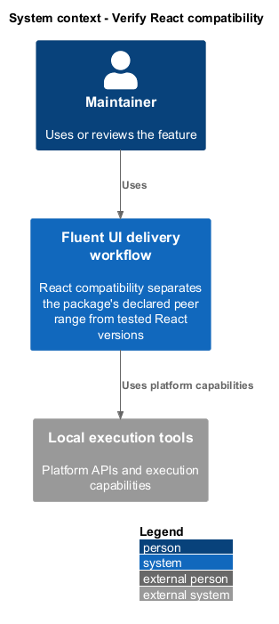
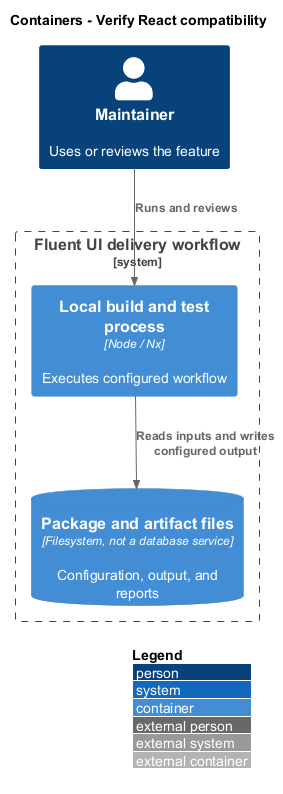
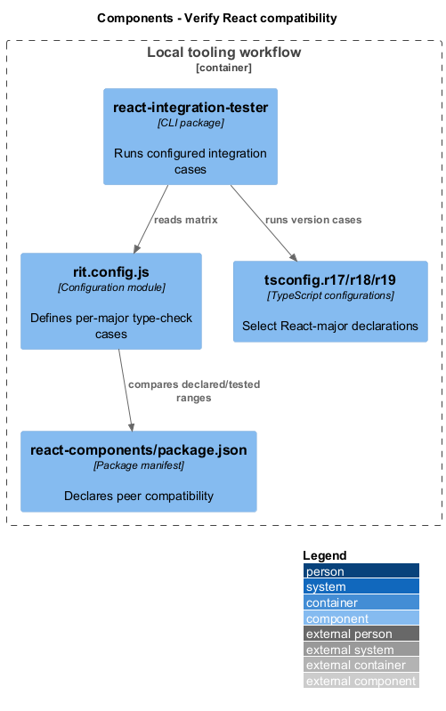
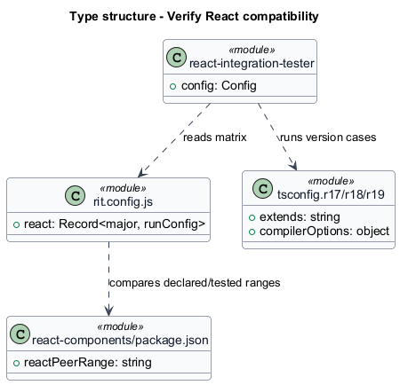
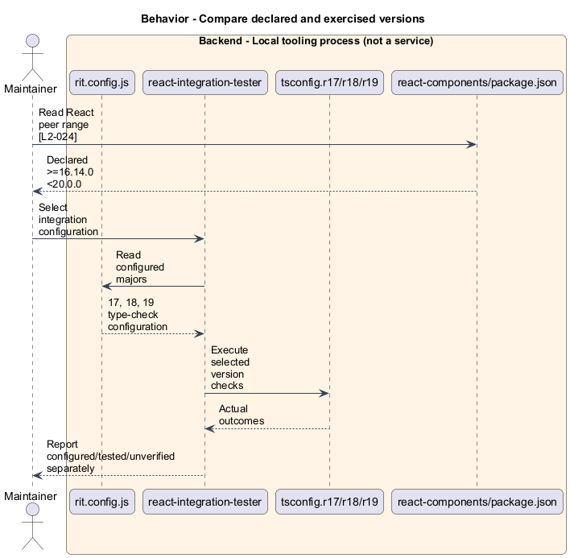
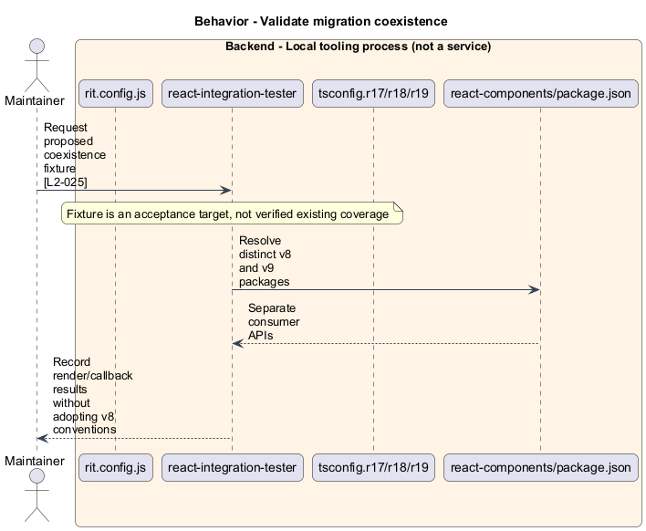

# Verify React compatibility

## Overview

React compatibility separates the package's declared peer range from tested React versions. Integration matrix — configured React-major runs that exercise version-specific type and runtime cases. A migration fixture hosts v8 and v9 controls through their separate package APIs.

## Description

The slice belongs to the `delivery-tooling` subsystem. It executes as local tooling or CI work. The backend tier denotes a tool process rather than an application service.

**Building blocks.** Names identify inspected implementations, platform types, or explicitly proposed acceptance artifacts.

- `rit.config.js` — Configuration module that defines per-major type-check cases.
- `react-integration-tester` — CLI package that runs configured integration cases.
- `tsconfig.r17/r18/r19` — TypeScript configurations that select React-major declarations.
- `react-components/package.json` — Package manifest that declares peer compatibility.

**Current behavior.** The suite declares React >=16.14.0 <20.0.0. The app configuration lists majors 17, 18, and 19 with type-check configurations. The repository plugin and inspected PR workflow explicitly select 17/18 integration target names. These are distinct configuration layers rather than evidence that every declared version passes every CI job.

**Conformance gaps and required changes.** React 16 lacks an entry in the inspected app matrix. The v8/v9 coexistence fixture remains proposed acceptance coverage. Reports shall distinguish peer declarations, configured runs, CI selection, and successful execution. Minimum supported browser versions remain `<TO SUPPLY>`.

**Validation scenarios.** Inspect matrix and target selection, then execute applicable per-major runs through Nx. Coexistence renders separately imported v8/v9 Buttons with each library's documented provider setup and independent callbacks.

**Source evidence.** These links establish provenance, not executed acceptance results.

- [rit.config.js](../../../../apps/rit-tests-v9/rit.config.js).
- [tsconfig.r17.json](../../../../apps/rit-tests-v9/tsconfig.r17.json).
- [tsconfig.r18.json](../../../../apps/rit-tests-v9/tsconfig.r18.json).
- [tsconfig.r19.json](../../../../apps/rit-tests-v9/tsconfig.r19.json).
- [README.md](../../../../tools/react-integration-tester/README.md).
- [package.json](../../../../packages/react-components/react-components/package.json).
- [pr.yml](../../../../.github/workflows/pr.yml).
- [README.md](../../../../README.md).

## Requirements

The table quotes exact L2 statements from the [detailed specification](../../../specs/L2.md). Original obligation wording is preserved in quotations.

| L2 ID | Refines (L1) | Requirement |
| --- | --- | --- |
| `L2-024` | `L1-009` | Compatibility documentation must distinguish declared peer ranges from the versions exercised by the integration suite. |
| `L2-025` | `L1-009` | The migration contract must retain distinct v8 and v9 packages and support a coexistence fixture without adopting v8 conventions for new v9 code. |

## Diagrams

Function modules and TypeScript records appear as UML projections rather than invented runtime classes. Proposed acceptance artifacts remain identified as targets. Fields and signatures show the slice rather than every public property.

### System context

The context view places the feature in its consumer application or delivery workflow. The external platform supplies execution capabilities.

### Containers

The container view identifies execution processes and artifact storage. Library packages remain within the consuming process.

### Components

The component view identifies the feature's blocks. Labelled relationships show implementation dependencies or explicit review relationships.

### Type structure

The type view shows representative fields and callable signatures. Dependency and inheritance arrows identify distinct structural relationships.

### Behavior — Compare declared and exercised versions

The sequence follows compare declared and exercised versions. Requirement IDs mark enforcement or acceptance-review steps, and alternate branches expose significant state or failure paths.

### Behavior — Validate migration coexistence

The sequence follows validate migration coexistence. Requirement IDs mark enforcement or acceptance-review steps, and alternate branches expose significant state or failure paths.

