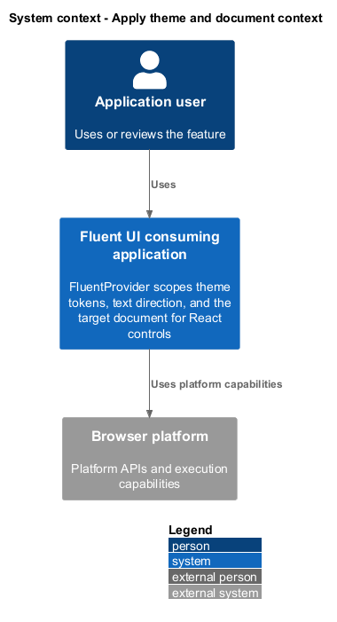
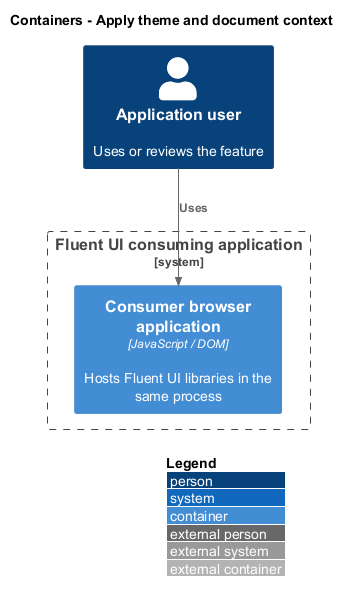
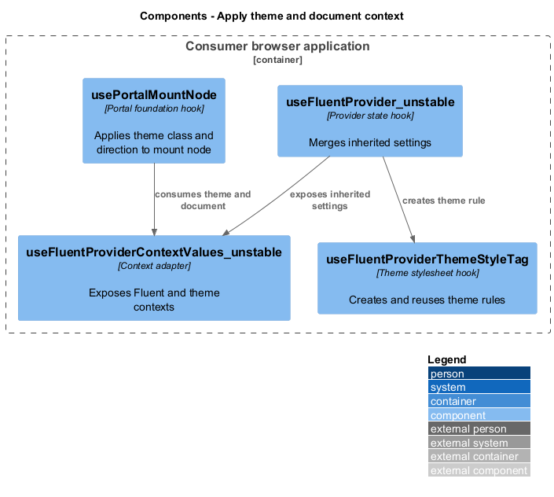
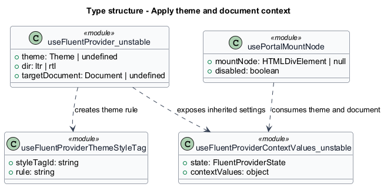
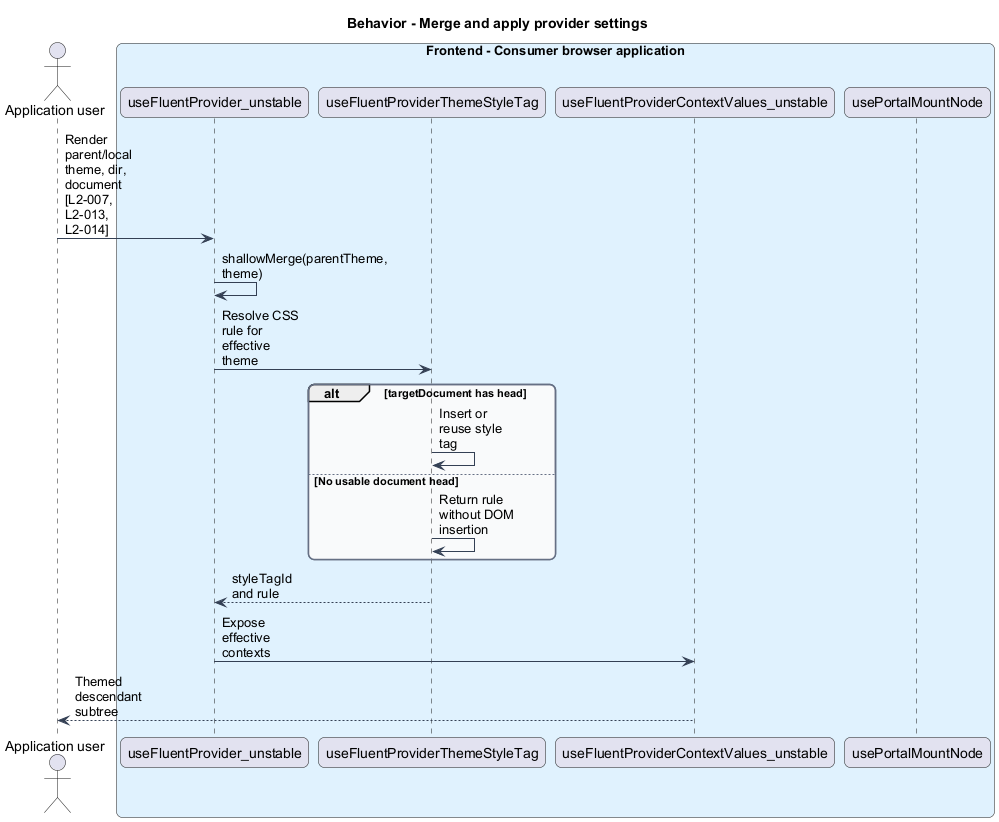
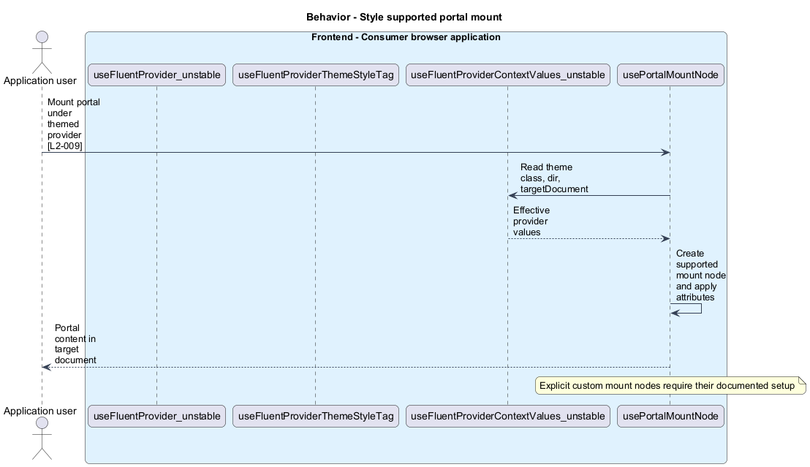

# Apply theme and document context

## Overview

`FluentProvider` scopes theme tokens, text direction, and the target document for React controls. Effective theme — parent token values combined with local overrides. A portal places content outside the physical provider subtree while retaining its React context.

## Description

The slice belongs to the `provider` subsystem. It executes in the consumer browser; no Fluent UI application backend participates.

**Building blocks.** Names identify inspected implementations, platform types, or explicitly proposed acceptance artifacts.

- `useFluentProvider_unstable` — Provider state hook that merges inherited settings.
- `useFluentProviderThemeStyleTag` — Theme stylesheet hook that creates and reuses theme rules.
- `useFluentProviderContextValues_unstable` — Context adapter that exposes Fluent and theme contexts.
- `usePortalMountNode` — Portal foundation hook that applies theme class and direction to mount node.

**Current behavior.** `shallowMerge` preserves the parent object when no override exists and replaces individual values when both objects exist. Direction and `targetDocument` inherit independently. The style hook emits a rule under a generated class and inserts it into the supplied document. Portal mount nodes consume theme classes and direction; explicit mount nodes have their own lifecycle.

**Conformance gaps and required changes.** Portal theme propagation shall be verified with default mount nodes and nested theme overrides. Custom mount nodes shall be described through their supported API rather than assumed to receive identical defaults. No complete alternate-document acceptance run is recorded.

**Validation scenarios.** Fixtures compare inherited tokens and overridden tokens, switch theme objects, inspect ltr/rtl context, mount inside an iframe, and inspect portal class rules. Development-mode fixtures capture the missing-theme warning.

**Source evidence.** These links establish provenance, not executed acceptance results.

- [useFluentProvider.ts](../../../../packages/react-components/react-provider/library/src/components/FluentProvider/useFluentProvider.ts).
- [useFluentProviderThemeStyleTag.ts](../../../../packages/react-components/react-provider/library/src/components/FluentProvider/useFluentProviderThemeStyleTag.ts).
- [useFluentProviderContextValues.ts](../../../../packages/react-components/react-provider/library/src/components/FluentProvider/useFluentProviderContextValues.ts).
- [usePortalMountNode.ts](../../../../packages/react-components/react-portal/library/src/components/Portal/usePortalMountNode.ts).
- [design-tokens.md](../../../../docs/architecture/design-tokens.md).

## Requirements

The table quotes exact L2 statements from the [detailed specification](../../../specs/L2.md). Original obligation wording is preserved in quotations.

| L2 ID | Refines (L1) | Requirement |
| --- | --- | --- |
| `L2-007` | `L1-003` | Nested FluentProvider themes must inherit parent values and override explicitly supplied values. |
| `L2-008` | `L1-003` | New React v9 styling must consume semantic design tokens and support the documented theme objects. |
| `L2-009` | `L1-003` | Provider-supported portals must receive the provider's theme when portal styling is enabled. |
| `L2-013` | `L1-005` | FluentProvider must inherit direction from its parent and support an explicit local override. |
| `L2-014` | `L1-005` | Document-dependent v9 behavior must use the supplied provider targetDocument and its defaultView. |
| `L2-038` | `L1-014` | Development warnings and isolation reports must identify the problem and the affected context. |

## Diagrams

Function modules and TypeScript records appear as UML projections rather than invented runtime classes. Proposed acceptance artifacts remain identified as targets. Fields and signatures show the slice rather than every public property.

### System context

The context view places the feature in its consumer application or delivery workflow. The external platform supplies execution capabilities.

### Containers

The container view identifies execution processes and artifact storage. Library packages remain within the consuming process.

### Components

The component view identifies the feature's blocks. Labelled relationships show implementation dependencies or explicit review relationships.

### Type structure

The type view shows representative fields and callable signatures. Dependency and inheritance arrows identify distinct structural relationships.

### Behavior — Merge and apply provider settings

The sequence follows merge and apply provider settings. Requirement IDs mark enforcement or acceptance-review steps, and alternate branches expose significant state or failure paths.

### Behavior — Style supported portal mount

The sequence follows style supported portal mount. Requirement IDs mark enforcement or acceptance-review steps, and alternate branches expose significant state or failure paths.

