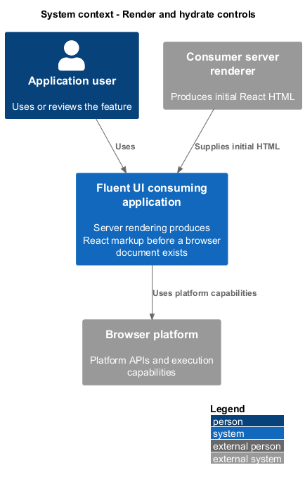
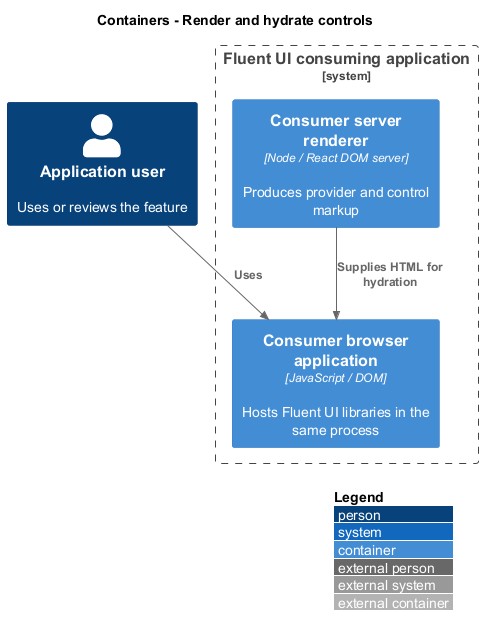
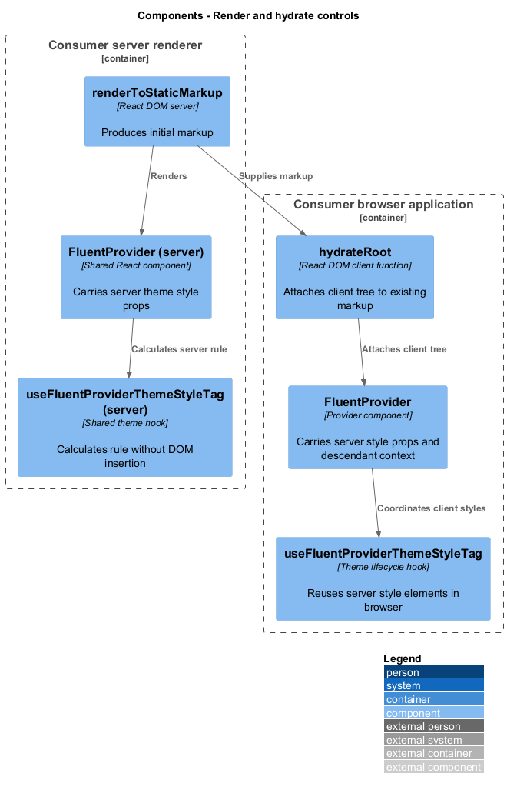
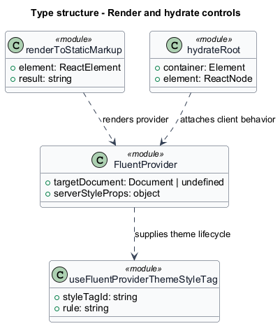
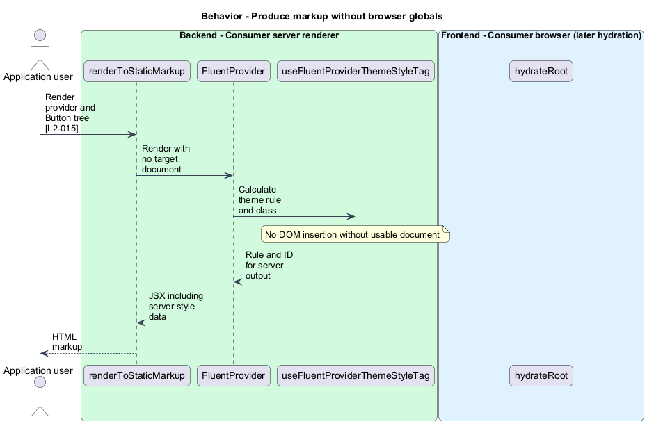
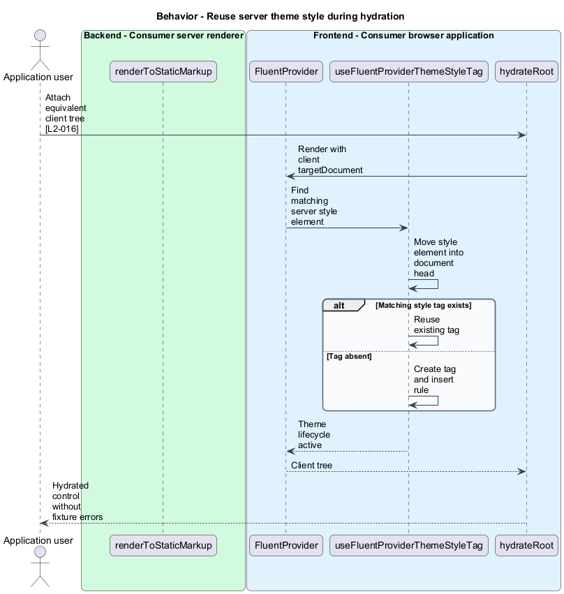

# Render and hydrate controls

## Overview

Server rendering produces React markup before a browser document exists. Hydration — attachment of client React behavior to equivalent server markup. `FluentProvider` carries theme rule data into server output and coordinates the corresponding client style element.

## Description

The slice belongs to the `provider` subsystem. It spans consumer server rendering and browser hydration; no Fluent UI application service is introduced.

**Building blocks.** Names identify inspected implementations, platform types, or explicitly proposed acceptance artifacts.

- `renderToStaticMarkup` — React server function that produces markup without a target document.
- `FluentProvider` — Provider component that carries server style props and descendant context.
- `useFluentProviderThemeStyleTag` — Theme lifecycle hook that reuses server style elements in browser.
- `hydrateRoot` — `React DOM` client function that attaches client tree to existing markup.

**Current behavior.** The theme style hook returns a class identifier and CSS rule even without a usable document. During client rendering, `useHandleSSRStyleElements` moves matching server style tags into head. The insertion effect reuses an existing tag or creates one, and removes its tracked tag on cleanup. The hydration test resets deterministic IDs between server and client rendering.

**Conformance gaps and required changes.** The existing provider hydration fixture is evidence, not a universal hydration proof for every exported control. Acceptance coverage shall include the requirement's themed `Button` server fixture and matching client setup. Browser-global guards follow AGENTS.md rather than archived examples.

**Validation scenarios.** Node fixtures remove browser globals and render the supported tree. Hydration fixtures keep IDs deterministic and fail on console.error. Any skipped SSR fixture remains unverified.

**Source evidence.** These links establish provenance, not executed acceptance results.

- [renderFluentProvider.tsx](../../../../packages/react-components/react-provider/library/src/components/FluentProvider/renderFluentProvider.tsx).
- [useFluentProviderThemeStyleTag.ts](../../../../packages/react-components/react-provider/library/src/components/FluentProvider/useFluentProviderThemeStyleTag.ts).
- [FluentProvider-hydrate.test.tsx](../../../../packages/react-components/react-provider/library/src/components/FluentProvider/FluentProvider-hydrate.test.tsx).
- [FluentProvider-node.test.tsx](../../../../packages/react-components/react-provider/library/src/components/FluentProvider/FluentProvider-node.test.tsx).
- [testing.md](../../../../docs/workflows/testing.md).

## Requirements

The table quotes exact L2 statements from the [detailed specification](../../../specs/L2.md). Original obligation wording is preserved in quotations.

| L2 ID | Refines (L1) | Requirement |
| --- | --- | --- |
| `L2-015` | `L1-006` | SSR-covered React v9 components must import and render in a server environment without requiring browser globals. |
| `L2-016` | `L1-006` | FluentProvider must hydrate its supported server markup without hydration errors. |

## Diagrams

Function modules and TypeScript records appear as UML projections rather than invented runtime classes. Proposed acceptance artifacts remain identified as targets. Fields and signatures show the slice rather than every public property.

### System context

The context view places the feature in its consumer application or delivery workflow. The external platform supplies execution capabilities.

### Containers

The container view identifies execution processes and artifact storage. Library packages remain within the consuming process.

### Components

The component view identifies the feature's blocks. Labelled relationships show implementation dependencies or explicit review relationships.

### Type structure

The type view shows representative fields and callable signatures. Dependency and inheritance arrows identify distinct structural relationships.

### Behavior — Produce markup without browser globals

The sequence follows produce markup without browser globals. Requirement IDs mark enforcement or acceptance-review steps, and alternate branches expose significant state or failure paths.

### Behavior — Reuse server theme style during hydration

The sequence follows reuse server theme style during hydration. Requirement IDs mark enforcement or acceptance-review steps, and alternate branches expose significant state or failure paths.

