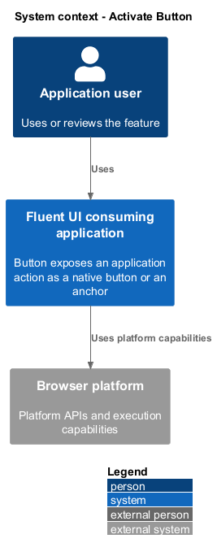
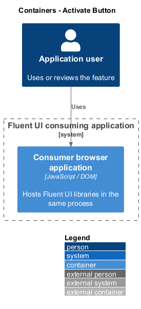
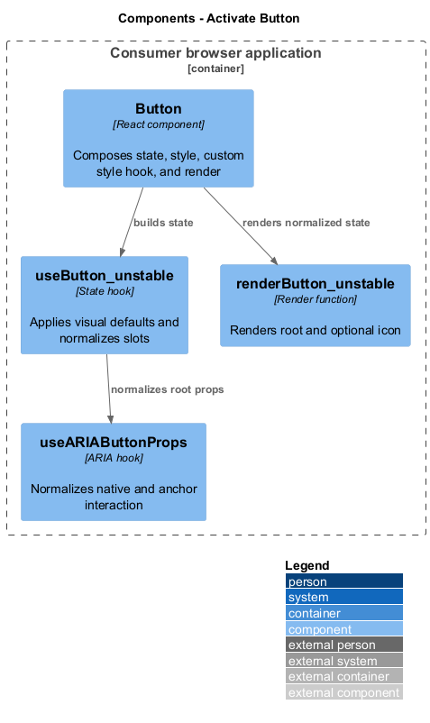
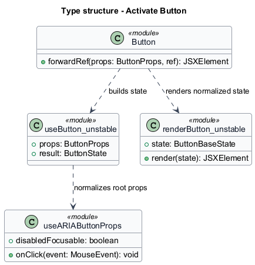
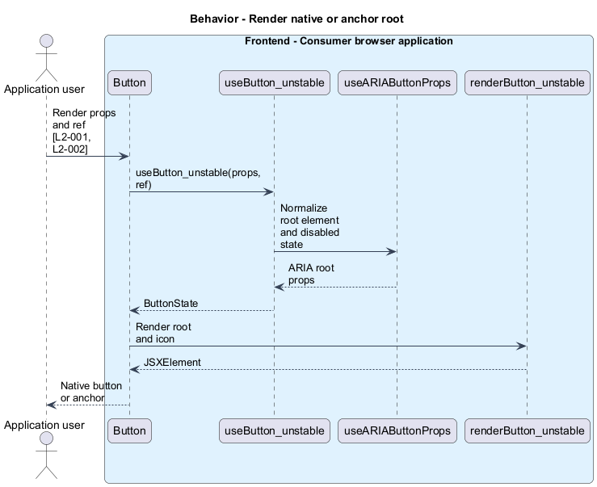
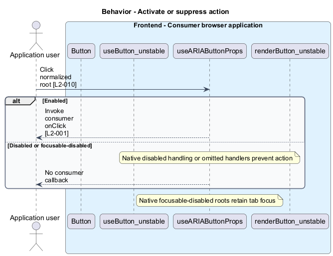

# Activate Button

## Overview

`Button` exposes an application action as a native button or an anchor. Activation — click or keyboard event that requests the consumer action. The consumer owns the action callback and any navigation destination. Disabled and focusable-disabled states preserve distinct keyboard behavior.

## Description

The slice belongs to the `react-ui` subsystem. It executes in the consumer browser; no Fluent UI application backend participates.

**Building blocks.** Names identify inspected implementations, platform types, or explicitly proposed acceptance artifacts.

- `Button` — React component that composes state, style, custom style hook, and render.
- `useButton_unstable` — State hook that applies visual defaults and normalizes slots.
- `useARIAButtonProps` — ARIA hook that normalizes native and anchor interaction.
- `renderButton_unstable` — Render function that renders root and optional icon.

**Current behavior.** The state hook defaults appearance to secondary, shape to rounded, and size to the inherited `ButtonContext` size or medium. Native roots default type to button. The ARIA hook removes href from disabled anchors and supplies button semantics when href is absent. Native focusable-disabled buttons expose aria-disabled and omit activation handlers.

**Conformance gaps and required changes.** Observed tests establish the documented disabled-state and anchor behaviors. Keyboard and click results still require execution before a conformance claim. The design preserves native form and link behavior rather than introducing an application action service.

**Validation scenarios.** Acceptance fixtures exercise default rendering, anchor roots with and without href, click callbacks, form non-submission, and the two disabled tab behaviors.

**Source evidence.** These links establish provenance, not executed acceptance results.

- [Button.tsx](../../../../packages/react-components/react-button/library/src/components/Button/Button.tsx).
- [useButton.ts](../../../../packages/react-components/react-button/library/src/components/Button/useButton.ts).
- [Button.types.ts](../../../../packages/react-components/react-button/library/src/components/Button/Button.types.ts).
- [renderButton.tsx](../../../../packages/react-components/react-button/library/src/components/Button/renderButton.tsx).
- [useARIAButtonProps.ts](../../../../packages/react-components/react-aria/library/src/button/useARIAButtonProps.ts).
- [Button.test.tsx](../../../../packages/react-components/react-button/library/src/components/Button/Button.test.tsx).

## Requirements

The table quotes exact L2 statements from the [detailed specification](../../../specs/L2.md). Original obligation wording is preserved in quotations.

| L2 ID | Refines (L1) | Requirement |
| --- | --- | --- |
| `L2-001` | `L1-001` | Button must provide native button behavior by default and forward consumer activation callbacks. |
| `L2-002` | `L1-001` | Button rendered as an anchor must expose the semantics appropriate to the presence of href. |
| `L2-010` | `L1-004` | Disabled states must prevent activation while distinguishing removal from the tab sequence from focusable disabled behavior. |

## Diagrams

Function modules and TypeScript records appear as UML projections rather than invented runtime classes. Proposed acceptance artifacts remain identified as targets. Fields and signatures show the slice rather than every public property.

### System context

The context view places the feature in its consumer application or delivery workflow. The external platform supplies execution capabilities.

### Containers

The container view identifies execution processes and artifact storage. Library packages remain within the consuming process.

### Components

The component view identifies the feature's blocks. Labelled relationships show implementation dependencies or explicit review relationships.

### Type structure

The type view shows representative fields and callable signatures. Dependency and inheritance arrows identify distinct structural relationships.

### Behavior — Render native or anchor root

The sequence follows render native or anchor root. Requirement IDs mark enforcement or acceptance-review steps, and alternate branches expose significant state or failure paths.

### Behavior — Activate or suppress action

The sequence follows activate or suppress action. Requirement IDs mark enforcement or acceptance-review steps, and alternate branches expose significant state or failure paths.

