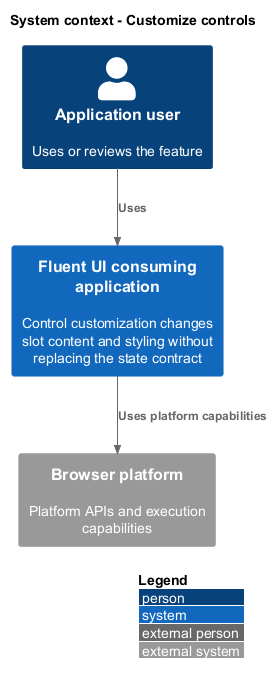
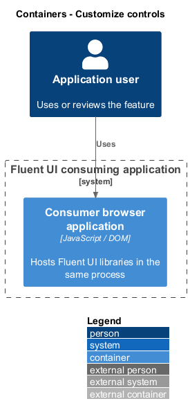
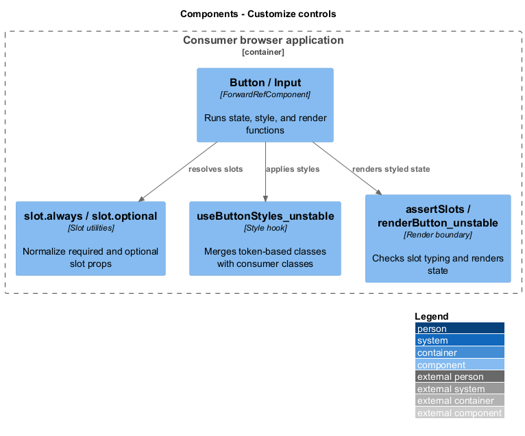
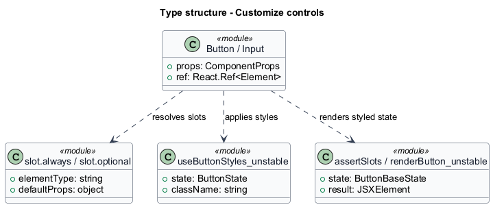
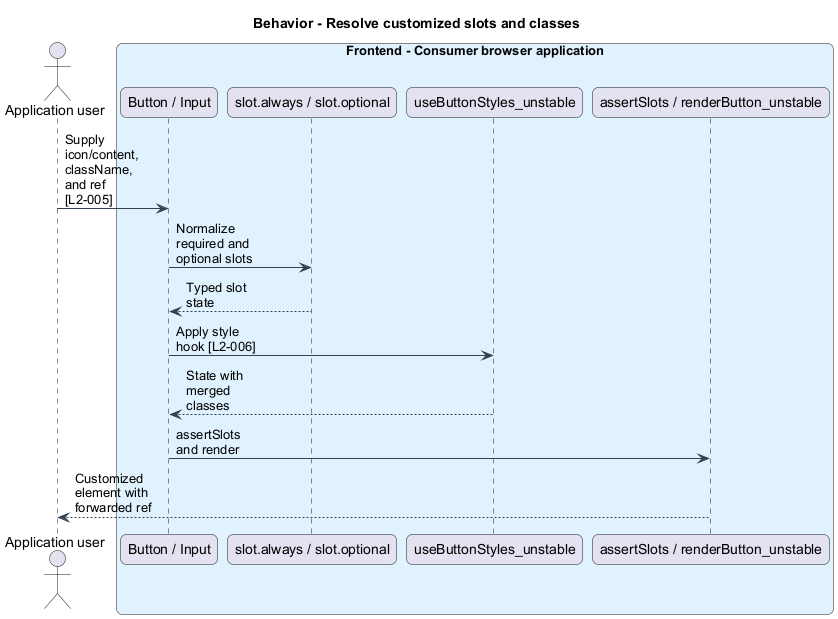
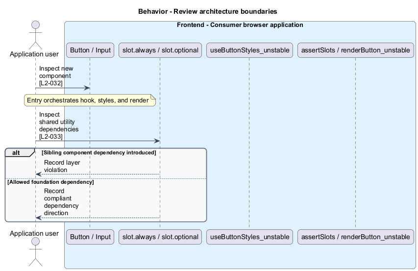

# Customize controls

## Overview

Control customization changes slot content and styling without replacing the state contract. Slot — typed component position resolved to an element or consumer render override. React v9 separates state preparation, token-based styling, and rendering, with refs identifying the documented primary element.

## Description

The slice belongs to the `react-ui` subsystem. It executes in the consumer browser; no Fluent UI application backend participates.

**Building blocks.** Names identify inspected implementations, platform types, or explicitly proposed acceptance artifacts.

- `Button / Input` — `ForwardRefComponent` that runs state, style, and render functions.
- `slot.always / slot.optional` — Slot utilities that normalize required and optional slot props.
- `useButtonStyles_unstable` — Style hook that merges token-based classes with consumer classes.
- `assertSlots / renderButton_unstable` — Render boundary that checks slot typing and renders state.

**Current behavior.** `Button` forwards its ref to the root. `Input` forwards its ref to the native input. Optional icon and content slots exist only when supplied. State fields flow through the style hook before rendering. The entry component also calls the provider's custom style hook.

**Conformance gaps and required changes.** New or modified hooks shall place consumer `className` last in `mergeClasses`. Existing component-to-component imports do not establish permission to add dependencies. The architecture review shall compare changes against AGENTS.md, including the existing `Input`-to-react-field dependency.

**Validation scenarios.** Conformance tests verify ref destinations and retained consumer classes. Inspection verifies file separation, `ForwardRefComponent` declarations, token references, and dependency direction.

**Source evidence.** These links establish provenance, not executed acceptance results.

- [Button.tsx](../../../../packages/react-components/react-button/library/src/components/Button/Button.tsx).
- [useButton.ts](../../../../packages/react-components/react-button/library/src/components/Button/useButton.ts).
- [useButtonStyles.styles.ts](../../../../packages/react-components/react-button/library/src/components/Button/useButtonStyles.styles.ts).
- [renderButton.tsx](../../../../packages/react-components/react-button/library/src/components/Button/renderButton.tsx).
- [useInput.ts](../../../../packages/react-components/react-input/library/src/components/Input/useInput.ts).
- [component-patterns.md](../../../../docs/architecture/component-patterns.md).
- [layers.md](../../../../docs/architecture/layers.md).
- [AGENTS.md](../../../../AGENTS.md).

## Requirements

The table quotes exact L2 statements from the [detailed specification](../../../specs/L2.md). Original obligation wording is preserved in quotations.

| L2 ID | Refines (L1) | Requirement |
| --- | --- | --- |
| `L2-005` | `L1-002` | Button and Input must preserve optional slot content and forward refs to their documented primary elements. |
| `L2-006` | `L1-002` | React v9 style hooks must retain consumer class names and place them last in each slot's mergeClasses call. |
| `L2-032` | `L1-012` | New v9 components must separate state, styles, render, types, and the forward-ref entry component. |
| `L2-033` | `L1-012` | New library dependencies must obey the documented tier boundaries. |

## Diagrams

Function modules and TypeScript records appear as UML projections rather than invented runtime classes. Proposed acceptance artifacts remain identified as targets. Fields and signatures show the slice rather than every public property.

### System context

The context view places the feature in its consumer application or delivery workflow. The external platform supplies execution capabilities.

### Containers

The container view identifies execution processes and artifact storage. Library packages remain within the consuming process.

### Components

The component view identifies the feature's blocks. Labelled relationships show implementation dependencies or explicit review relationships.

### Type structure

The type view shows representative fields and callable signatures. Dependency and inheritance arrows identify distinct structural relationships.

### Behavior — Resolve customized slots and classes

The sequence follows resolve customized slots and classes. Requirement IDs mark enforcement or acceptance-review steps, and alternate branches expose significant state or failure paths.

### Behavior — Review architecture boundaries

The sequence follows review architecture boundaries. Requirement IDs mark enforcement or acceptance-review steps, and alternate branches expose significant state or failure paths.

