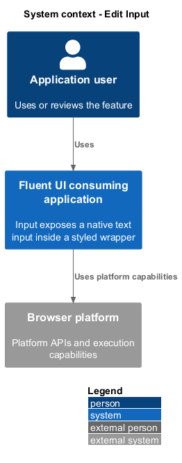
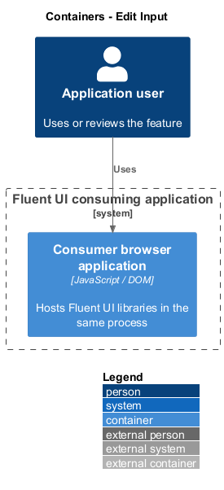
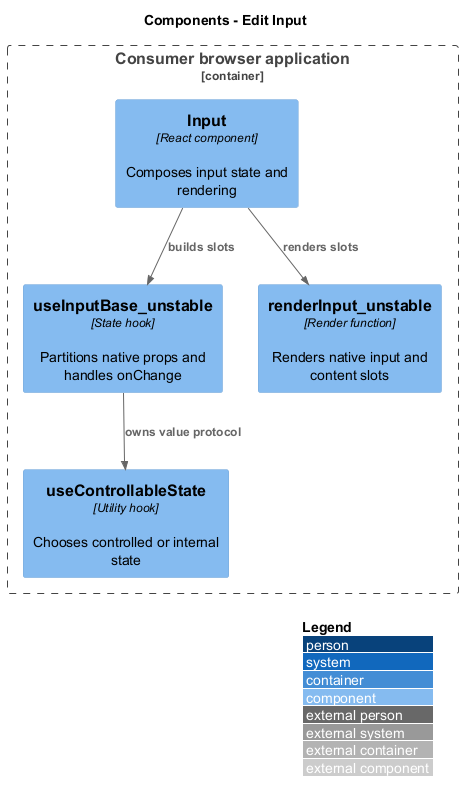
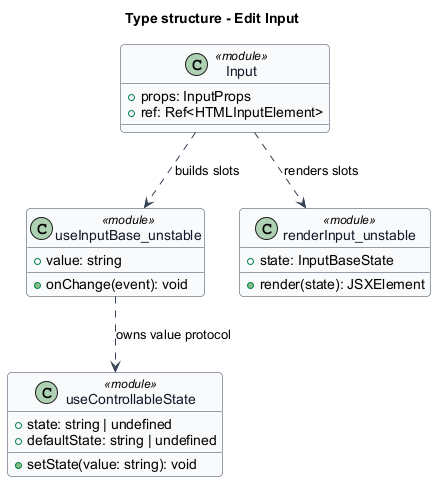
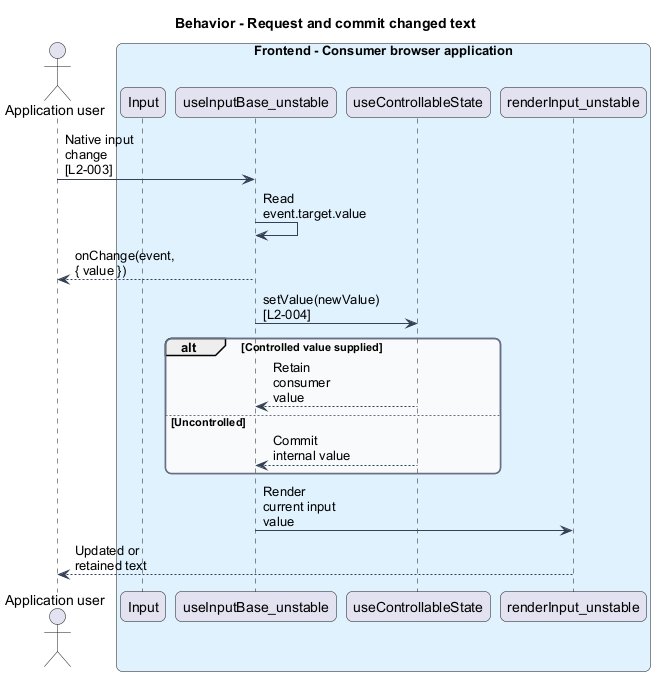
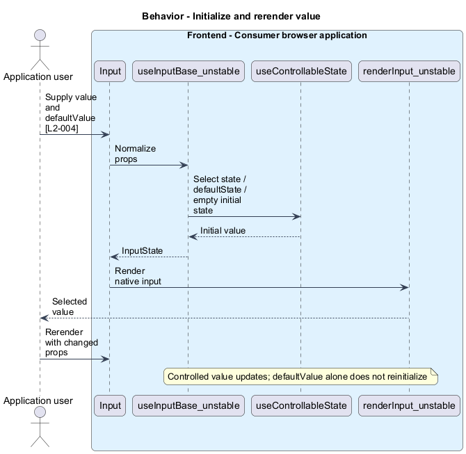

# Edit Input

## Overview

`Input` exposes a native text input inside a styled wrapper. Controlled value — value supplied and updated by the consumer. Uncontrolled value — value initialized from `defaultValue` and then maintained by the control. These modes keep text ownership explicit.

## Description

The slice belongs to the `react-ui` subsystem. It executes in the consumer browser; no Fluent UI application backend participates.

**Building blocks.** Names identify inspected implementations, platform types, or explicitly proposed acceptance artifacts.

- `Input` — React component that composes input state and rendering.
- `useInputBase_unstable` — State hook that partitions native props and handles `onChange`.
- `useControllableState` — Utility hook that chooses controlled or internal state.
- `renderInput_unstable` — Render function that renders native input and content slots.

**Current behavior.** The base hook obtains field control props, creates controllable state with an empty initial value, and partitions native input properties from wrapper properties. Its `onChange` handler reads ev.target.value, calls the consumer callback with a value data object, and requests a state update. Controlled state retains the supplied value until the consumer updates it.

**Conformance gaps and required changes.** The hook imports react-field, an existing component package dependency that conflicts with the prescribed layer boundary. Remediation shall move shared field integration behind an allowed foundation without changing `Input`'s public state protocol. Scope and ownership of that foundation change remain `<TO SUPPLY>`.

**Validation scenarios.** Fixtures cover empty defaults, callbacks on entry and clearing, value precedence, controlled rerenders, and changes to `defaultValue` after initialization.

**Source evidence.** These links establish provenance, not executed acceptance results.

- [Input.tsx](../../../../packages/react-components/react-input/library/src/components/Input/Input.tsx).
- [useInput.ts](../../../../packages/react-components/react-input/library/src/components/Input/useInput.ts).
- [Input.types.ts](../../../../packages/react-components/react-input/library/src/components/Input/Input.types.ts).
- [renderInput.tsx](../../../../packages/react-components/react-input/library/src/components/Input/renderInput.tsx).
- [Input.test.tsx](../../../../packages/react-components/react-input/library/src/components/Input/Input.test.tsx).

## Requirements

The table quotes exact L2 statements from the [detailed specification](../../../specs/L2.md). Original obligation wording is preserved in quotations.

| L2 ID | Refines (L1) | Requirement |
| --- | --- | --- |
| `L2-003` | `L1-001` | Input must initialize its native input slot predictably and notify consumers of changed text. |
| `L2-004` | `L1-002` | Input must keep controlled values owned by the consumer and use defaultValue only for initialization. |

## Diagrams

Function modules and TypeScript records appear as UML projections rather than invented runtime classes. Proposed acceptance artifacts remain identified as targets. Fields and signatures show the slice rather than every public property.

### System context

The context view places the feature in its consumer application or delivery workflow. The external platform supplies execution capabilities.

### Containers

The container view identifies execution processes and artifact storage. Library packages remain within the consuming process.

### Components

The component view identifies the feature's blocks. Labelled relationships show implementation dependencies or explicit review relationships.

### Type structure

The type view shows representative fields and callable signatures. Dependency and inheritance arrows identify distinct structural relationships.

### Behavior — Request and commit changed text

The sequence follows request and commit changed text. Requirement IDs mark enforcement or acceptance-review steps, and alternate branches expose significant state or failure paths.

### Behavior — Initialize and rerender value

The sequence follows initialize and rerender value. Requirement IDs mark enforcement or acceptance-review steps, and alternate branches expose significant state or failure paths.

