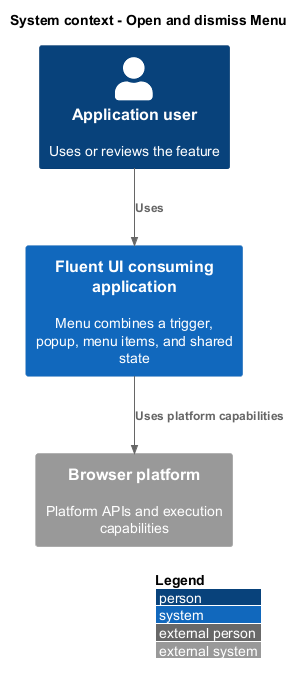
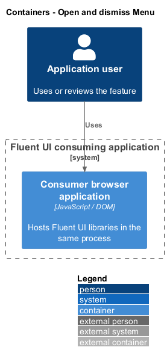
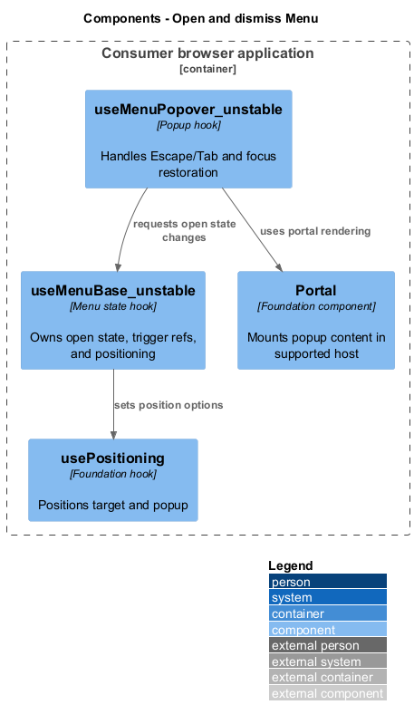
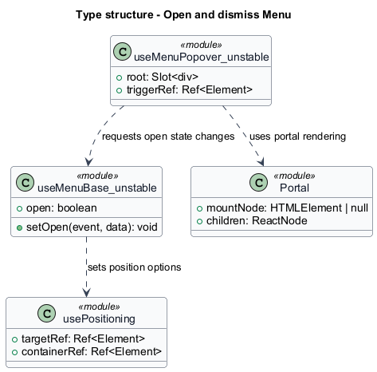
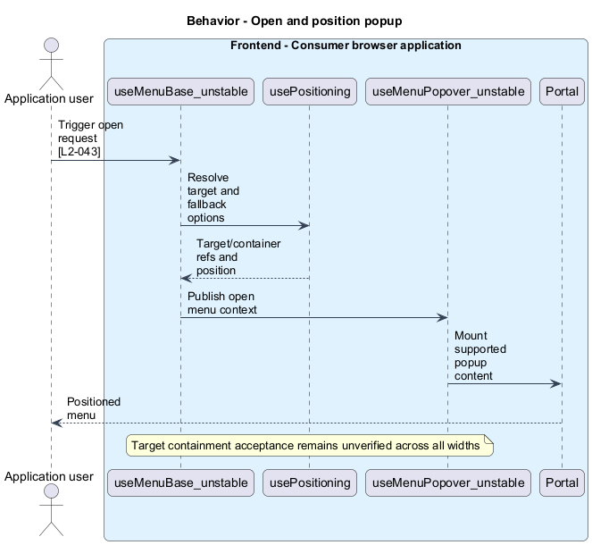
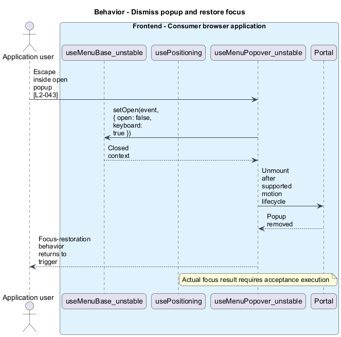

# Open and dismiss Menu

## Overview

Menu combines a trigger, popup, menu items, and shared state. Popup — positioned surface mounted inline or through a portal. Keyboard opening, item focus, dismissal, and viewport containment form one interaction rather than independent layout mechanisms.

## Description

The slice belongs to the `react-ui` subsystem. It executes in the consumer browser; no Fluent UI application backend participates.

**Building blocks.** Names identify inspected implementations, platform types, or explicitly proposed acceptance artifacts.

- `useMenuBase_unstable` — Menu state hook that owns open state, trigger refs, and positioning.
- `usePositioning` — Foundation hook that positions target and popup.
- `useMenuPopover_unstable` — Popup hook that handles Escape/Tab and focus restoration.
- `Portal` — Foundation component that mounts popup content in supported host.

**Current behavior.** The Menu base hook defaults root menus below/start and submenus after/top, with submenu fallback positions. It delegates positioning to react-positioning and handles controlled or internal open state. The popover handles Escape and Tab, uses direction-sensitive submenu closing keys, and layers focus-restoration attributes.

**Conformance gaps and required changes.** L2-043 specifies target containment and keyboard access across the viewport matrix. Full matrix execution remains unverified. Tall-content scrolling shall be tested with an explicitly scrollable fixture; a universal application overflow policy is not inferred.

**Validation scenarios.** Fixtures open near the right viewport edge, reach enabled items by keyboard, close with Escape, and verify trigger focus restoration. Fitting popups allow one CSS pixel of rounding tolerance.

**Source evidence.** These links establish provenance, not executed acceptance results.

- [useMenu.tsx](../../../../packages/react-components/react-menu/library/src/components/Menu/useMenu.tsx).
- [useMenuPopover.ts](../../../../packages/react-components/react-menu/library/src/components/MenuPopover/useMenuPopover.ts).
- [renderMenuPopover.tsx](../../../../packages/react-components/react-menu/library/src/components/MenuPopover/renderMenuPopover.tsx).
- [usePortal.ts](../../../../packages/react-components/react-portal/library/src/components/Portal/usePortal.ts).

## Requirements

The table quotes exact L2 statements from the [detailed specification](../../../specs/L2.md). Original obligation wording is preserved in quotations.

| L2 ID | Refines (L1) | Requirement |
| --- | --- | --- |
| `L2-043` | `L1-016` | Popup acceptance fixtures must define observable positioning and focus behavior across the viewport matrix. |

## Diagrams

Function modules and TypeScript records appear as UML projections rather than invented runtime classes. Proposed acceptance artifacts remain identified as targets. Fields and signatures show the slice rather than every public property.

### System context

The context view places the feature in its consumer application or delivery workflow. The external platform supplies execution capabilities.

### Containers

The container view identifies execution processes and artifact storage. Library packages remain within the consuming process.

### Components

The component view identifies the feature's blocks. Labelled relationships show implementation dependencies or explicit review relationships.

### Type structure

The type view shows representative fields and callable signatures. Dependency and inheritance arrows identify distinct structural relationships.

### Behavior — Open and position popup

The sequence follows open and position popup. Requirement IDs mark enforcement or acceptance-review steps, and alternate branches expose significant state or failure paths.

### Behavior — Dismiss popup and restore focus

The sequence follows dismiss popup and restore focus. Requirement IDs mark enforcement or acceptance-review steps, and alternate branches expose significant state or failure paths.

