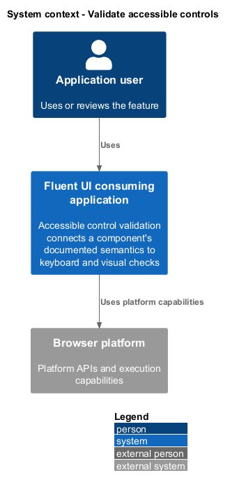
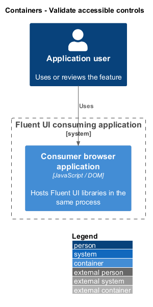
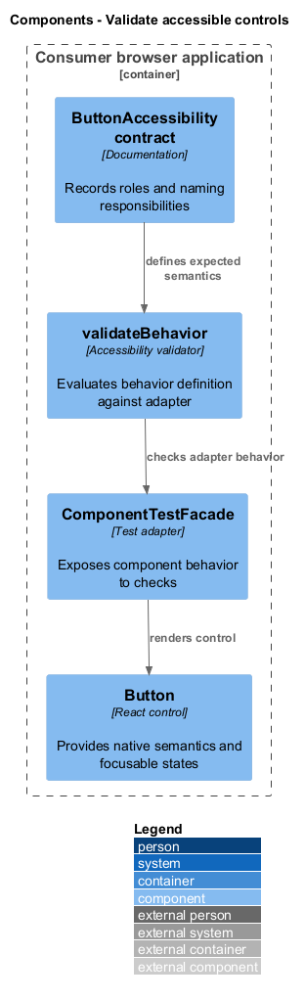
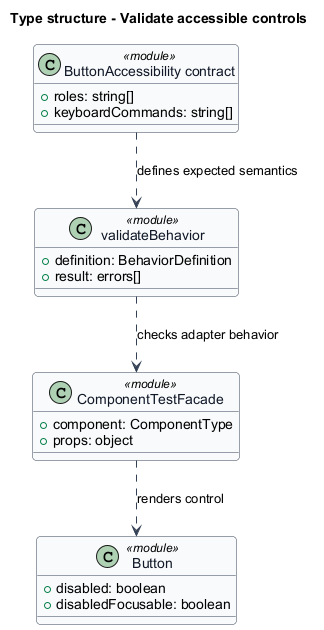
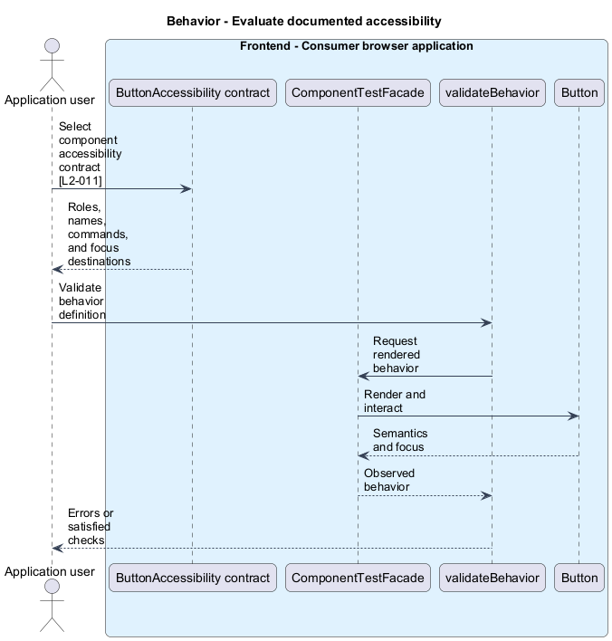
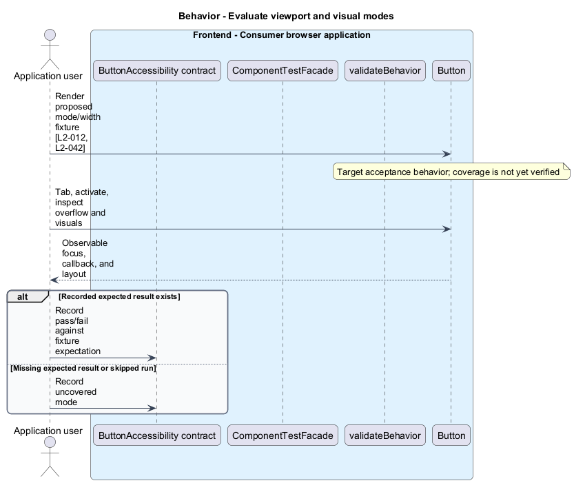

# Validate accessible controls

## Overview

Accessible control validation connects a component's documented semantics to keyboard and visual checks. Accessibility contract — recorded roles, names, key commands, and focus destinations for a component family. The viewport matrix tests local controls independently of host application layout.

## Description

The slice belongs to the `react-ui` subsystem. It executes in the consumer browser; no Fluent UI application backend participates.

**Building blocks.** Names identify inspected implementations, platform types, or explicitly proposed acceptance artifacts.

- `ButtonAccessibility contract` — Documentation that records roles and naming responsibilities.
- `ComponentTestFacade` — Test adapter that exposes component behavior to checks.
- `validateBehavior` — Accessibility validator that evaluates behavior definition against adapter.
- `Button` — React control that provides native semantics and focusable states.

**Current behavior.** `Button` tests instantiate `ComponentTestFacade` and `validateBehavior` with `buttonAccessibilityBehaviorDefinition`. Conformance and interaction tests provide evidence for roles and focus. Component documentation conventions provide dedicated accessibility guidance or specifications where present.

**Conformance gaps and required changes.** The complete forced-colors, reduced-motion, and nine-width acceptance matrices are targets with unverified coverage. New acceptance fixtures shall record the expected visual and keyboard result before claiming coverage. Numeric timing and contrast targets beyond the requirements remain `<TO SUPPLY>`.

**Validation scenarios.** Proposed viewport fixtures use 375, 575, 576, 767, 768, 991, 992, 1199, and 1200 CSS pixels at height 800. They inspect overflow, keyboard reachability, callback count, and input editing.

**Source evidence.** These links establish provenance, not executed acceptance results.

- [Button.test.tsx](../../../../packages/react-components/react-button/library/src/components/Button/Button.test.tsx).
- [component-patterns.md](../../../../docs/architecture/component-patterns.md).
- [testing.md](../../../../docs/workflows/testing.md).
- [MenuControlledCheckboxItems.stories.tsx](../../../../packages/react-components/react-menu/stories/src/Menu/MenuControlledCheckboxItems.stories.tsx).

## Requirements

The table quotes exact L2 statements from the [detailed specification](../../../specs/L2.md). Original obligation wording is preserved in quotations.

| L2 ID | Refines (L1) | Requirement |
| --- | --- | --- |
| `L2-011` | `L1-004` | Each specified component family must expose an accessibility contract and corresponding checks for its semantics, keyboard commands, and focus transitions. |
| `L2-012` | `L1-004` | UI families with visual states or motion must include forced-colors and reduced-motion acceptance fixtures. This is a required coverage contract, not a claim of verified universal compliance. |
| `L2-042` | `L1-016` | UI acceptance fixtures must cover representative XS through XL viewports without forcing an application layout policy. |

## Diagrams

Function modules and TypeScript records appear as UML projections rather than invented runtime classes. Proposed acceptance artifacts remain identified as targets. Fields and signatures show the slice rather than every public property.

### System context

The context view places the feature in its consumer application or delivery workflow. The external platform supplies execution capabilities.

### Containers

The container view identifies execution processes and artifact storage. Library packages remain within the consuming process.

### Components

The component view identifies the feature's blocks. Labelled relationships show implementation dependencies or explicit review relationships.

### Type structure

The type view shows representative fields and callable signatures. Dependency and inheritance arrows identify distinct structural relationships.

### Behavior — Evaluate documented accessibility

The sequence follows evaluate documented accessibility. Requirement IDs mark enforcement or acceptance-review steps, and alternate branches expose significant state or failure paths.

### Behavior — Evaluate viewport and visual modes

The sequence follows evaluate viewport and visual modes. Requirement IDs mark enforcement or acceptance-review steps, and alternate branches expose significant state or failure paths.

