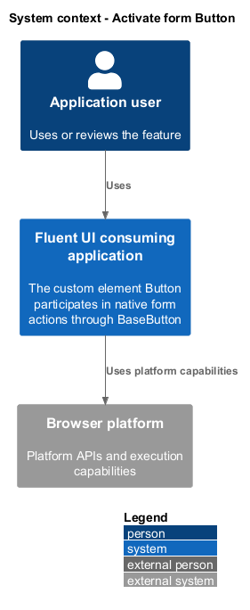
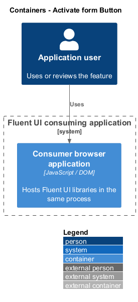
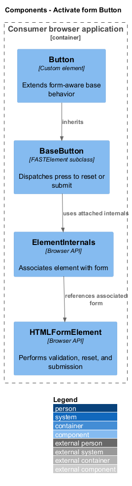
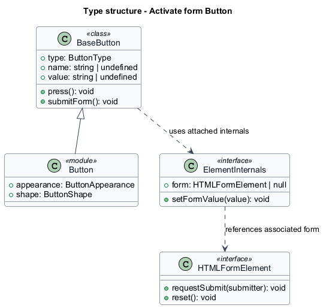
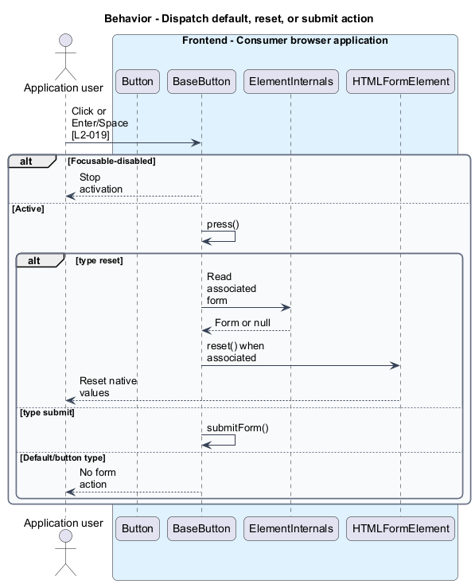
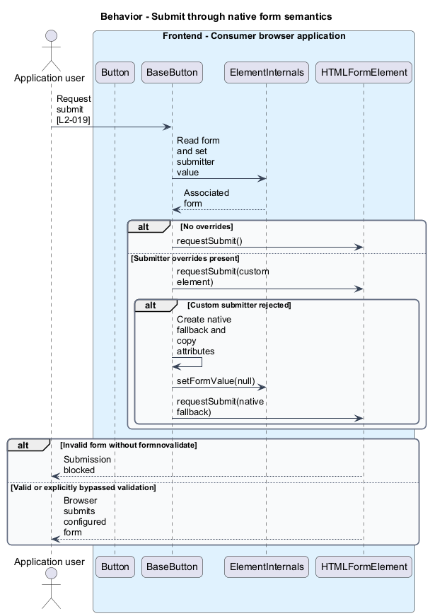

# Activate form Button

## Overview

The custom element `Button` participates in native form actions through `BaseButton`. Form-associated element — custom element connected to a form through `ElementInternals`. A native fallback submit control preserves browser form override behavior where custom submitters are unsupported.

## Description

The slice belongs to the `web-components` subsystem. It executes in the consumer browser; no Fluent UI application backend participates.

**Building blocks.** Names identify inspected implementations, platform types, or explicitly proposed acceptance artifacts.

- `Button` — Custom element that extends form-aware base behavior.
- `BaseButton` — `FASTElement` subclass that dispatches `press` to reset or submit.
- `ElementInternals` — Browser API that associates element with form.
- `HTMLFormElement` — Browser API that performs validation, reset, and submission.

**Current behavior.** `BaseButton` extends `FASTElement` and declares `formAssociated`=true. `clickHandler` and `keypressHandler` suppress focusable-disabled activation; `press` selects reset or submit by type. `submitForm` guards absent form and disabled state, uses direct `requestSubmit` when overrides are absent, and otherwise attempts custom-element submission. A catch path mirrors attributes onto a hidden native button.

**Conformance gaps and required changes.** Source review does not prove every disabled and invalid-form path across browsers. Template and browser behavior participate in those paths. Future changes shall preserve validation and submitter overrides instead of bypassing browser submission with form.submit().

**Validation scenarios.** The existing browser tests cover default non-submission, named submit values, reset, disabled controls, referenced forms, form overrides, and `formnovalidate`. Six configured browser/render-mode projects remain the execution matrix.

**Source evidence.** These links establish provenance, not executed acceptance results.

- [button.ts](../../../../packages/web-components/src/button/button.ts).
- [button.base.ts](../../../../packages/web-components/src/button/button.base.ts).
- [button.template.ts](../../../../packages/web-components/src/button/button.template.ts).
- [button.spec.ts](../../../../packages/web-components/src/button/button.spec.ts).

## Requirements

The table quotes exact L2 statements from the [detailed specification](../../../specs/L2.md). Original obligation wording is preserved in quotations.

| L2 ID | Refines (L1) | Requirement |
| --- | --- | --- |
| `L2-019` | `L1-007` | The Web Component Button must honor its type and form participation contract. |

## Diagrams

Function modules and TypeScript records appear as UML projections rather than invented runtime classes. Proposed acceptance artifacts remain identified as targets. Fields and signatures show the slice rather than every public property.

### System context

The context view places the feature in its consumer application or delivery workflow. The external platform supplies execution capabilities.

### Containers

The container view identifies execution processes and artifact storage. Library packages remain within the consuming process.

### Components

The component view identifies the feature's blocks. Labelled relationships show implementation dependencies or explicit review relationships.

### Type structure

The type view shows representative fields and callable signatures. Dependency and inheritance arrows identify distinct structural relationships.

### Behavior — Dispatch default, reset, or submit action

The sequence follows dispatch default, reset, or submit action. Requirement IDs mark enforcement or acceptance-review steps, and alternate branches expose significant state or failure paths.

### Behavior — Submit through native form semantics

The sequence follows submit through native form semantics. Requirement IDs mark enforcement or acceptance-review steps, and alternate branches expose significant state or failure paths.

