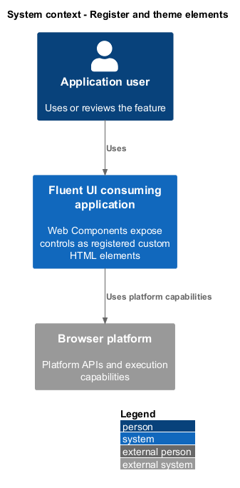
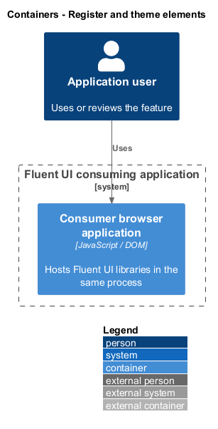
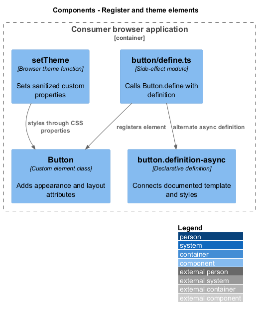
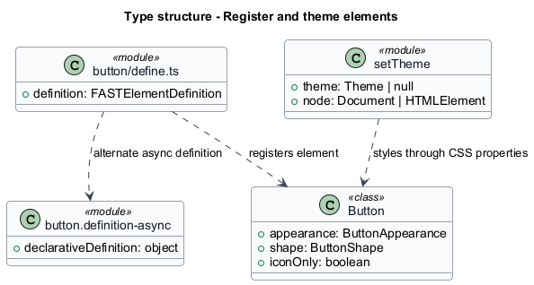
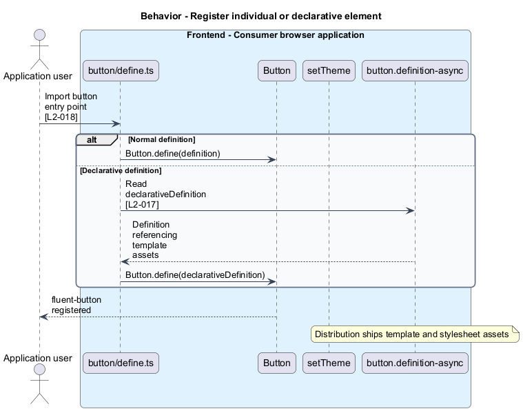
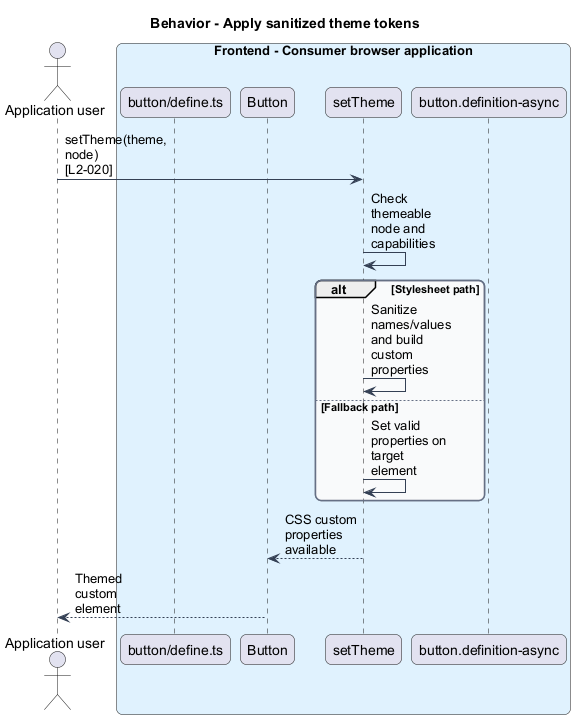

# Register and theme elements

## Overview

Web Components expose controls as registered custom HTML elements. Registration — association of a tag name with an element implementation and definition. Declarative assets expose templates and styles for the documented server-rendering and hydration integration.

## Description

The slice belongs to the `web-components` subsystem. It executes in the consumer browser; no Fluent UI application backend participates.

**Building blocks.** Names identify inspected implementations, platform types, or explicitly proposed acceptance artifacts.

- `button/define.ts` — Side-effect module that calls `Button`.define with definition.
- `Button` — Custom element class that adds appearance and layout attributes.
- `setTheme` — Browser theme function that sets sanitized custom properties.
- `button.definition-async` — Declarative definition that connects documented template and styles.

**Current behavior.** The individual define module calls `Button`.define(definition). The async module uses declarativeDefinition instead. `setTheme` targets global or local nodes, prefers constructed stylesheets where supported, and falls back to inline custom properties. Token names and values pass sanitization before stylesheet construction. The package ships a custom elements manifest.

**Conformance gaps and required changes.** set-theme.ts probes document and window at module evaluation, so the browser theming entry point is not an inferred Node-safe API. Declarative SSR uses the documented asset integration. The six browser/render-mode projects establish configured coverage only; successful runtime coverage remains unverified.

**Validation scenarios.** Fresh registry fixtures exercise individual and aggregate entry points. Distribution checks resolve template.html, styles.css, and custom-elements.json. Browser tests run CSR and SSR projects in Chromium, Firefox, and WebKit.

**Source evidence.** These links establish provenance, not executed acceptance results.

- [define.ts](../../../../packages/web-components/src/button/define.ts).
- [define-async.ts](../../../../packages/web-components/src/button/define-async.ts).
- [button.ts](../../../../packages/web-components/src/button/button.ts).
- [button.definition.ts](../../../../packages/web-components/src/button/button.definition.ts).
- [set-theme.ts](../../../../packages/web-components/src/theme/set-theme.ts).
- [package.json](../../../../packages/web-components/package.json).
- [playwright.config.ts](../../../../packages/web-components/playwright.config.ts).
- [README.md](../../../../packages/web-components/README.md).

## Requirements

The table quotes exact L2 statements from the [detailed specification](../../../specs/L2.md). Original obligation wording is preserved in quotations.

| L2 ID | Refines (L1) | Requirement |
| --- | --- | --- |
| `L2-017` | `L1-006` | Web Component distributions must ship documented declarative templates and extracted styles consistent with the SSR generation workflow. |
| `L2-018` | `L1-007` | Consumers must be able to register Web Components using individual and aggregate side-effect entry points. |
| `L2-020` | `L1-007` | Web Components must support theme setup and ship machine-readable component metadata. |
| `L2-026` | `L1-009` | The configured Web Component acceptance suite must retain its browser and rendering-mode matrix. |

## Diagrams

Function modules and TypeScript records appear as UML projections rather than invented runtime classes. Proposed acceptance artifacts remain identified as targets. Fields and signatures show the slice rather than every public property.

### System context

The context view places the feature in its consumer application or delivery workflow. The external platform supplies execution capabilities.

### Containers

The container view identifies execution processes and artifact storage. Library packages remain within the consuming process.

### Components

The component view identifies the feature's blocks. Labelled relationships show implementation dependencies or explicit review relationships.

### Type structure

The type view shows representative fields and callable signatures. Dependency and inheritance arrows identify distinct structural relationships.

### Behavior — Register individual or declarative element

The sequence follows register individual or declarative element. Requirement IDs mark enforcement or acceptance-review steps, and alternate branches expose significant state or failure paths.

### Behavior — Apply sanitized theme tokens

The sequence follows apply sanitized theme tokens. Requirement IDs mark enforcement or acceptance-review steps, and alternate branches expose significant state or failure paths.

